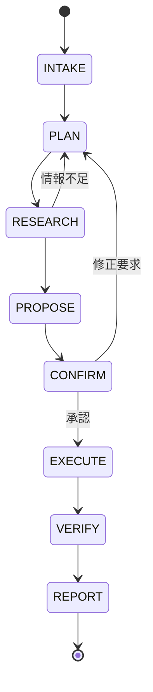

# Dan状態機械アーキテクチャ設計

## 進捗サマリー（2026-01-07更新）

| Step | 内容 | 状態 |
|------|------|------|
| Step 0 | EXReservationExecutor復元 | ⚠️ 部分的（ログイン未修正） |
| Step 1 | AgentState + 状態機械 | ✅ 完了 |
| Step 2a | INTAKE/PLANプロンプト | ✅ 完了 |
| Step 2b | RESEARCH/PROPOSEプロンプト | ✅ 完了 |
| Step 3 | CONFIRM/EXECUTE/VERIFY/REPORT | ✅ 完了 |
| Step 4 | Critic実装 | ✅ 完了 |
| Step 5 | プロセス表示自動生成 | ✅ 完了 |
| 追加 | Jina AI Reader + Tavily統合 | ✅ 完了 |
| Step 6 | agent.pyへの統合 | ✅ 完了（2026-01-07） |
| Step 7 | フロントエンド接続 | ❌ 未着手 |
| Step 8 | Executorログイン修正 | ❌ 未着手 |

### 動作確認済み（test_state_machine.py）
- ✅ 新幹線予約リクエスト → のぞみ45号を提案
- ✅ パラメータ抽出（departure/arrival）正常
- ✅ Criticが提案を評価し妥当と判断
- ✅ 雑談メッセージ → 通常会話として応答
- ✅ **agent.py統合テスト** - 10件すべてPASS（2026-01-07追加）
  - `test_process_with_state_machine_new_session`
  - `test_process_with_state_machine_task`
  - `test_confirm_state_machine`
  - `test_get_state_machine_state`
  - `test_get_state_machine_state_not_found`

---

## 設計思想（3つの柱）

### 1. 状態機械で固定する

自由に考えさせるほど事故るので、ループは固定の状態遷移にする。



| ステート | 役割 | LLMの出力 |
|----------|------|-----------|
| INTAKE | 要望を構造化（目的、期限、予算、制約） | `{intent, constraints, deadline}` |
| PLAN | サブタスク分解 + 必要ツール列挙 + 停止条件 | `{tasks, tools, stop_conditions}` |
| RESEARCH | 検索/Executor.search()で根拠を集める | `{findings, options}` |
| PROPOSE | 候補提示（比較表・おすすめ・リスク） | `{proposal, reasoning_steps}` |
| CONFIRM | 実行の最終確認（**不可逆操作は必須**） | ユーザー承認待ち |
| EXECUTE | Executor.execute()で実行 | 実行結果 |
| VERIFY | 完了確認（予約番号、スクショ等） | `{confirmation, evidence}` |
| REPORT | 結果と次の一手 | 最終レポート |

**重要**: 支払い・振込・申込など不可逆操作は必ず CONFIRM を挟む。

---

### 2. ReAct/Agent設計

ツール呼び出し + 状態管理 + 停止条件を明確にする。

```python
class AgentState:
    current_state: str  # INTAKE, PLAN, RESEARCH, ...
    intake_result: dict  # INTAKEの出力
    plan_result: dict    # PLANの出力
    research_result: dict  # RESEARCHの出力
    proposal: dict       # PROPOSEの出力
    execution_result: dict  # EXECUTEの出力
    
    def can_proceed_to_propose(self) -> bool:
        """停止条件: 十分な根拠が揃ったか"""
        return len(self.research_result.get("options", [])) > 0
```

---

### 3. Critic（評価器）

LLMの出力を別レーンでチェックする。

```python
class Critic:
    async def evaluate_proposal(self, proposal: dict, user_intent: dict) -> dict:
        """提案が妥当かチェック"""
        # - ユーザーの意図と合っているか
        # - 見落としはないか
        # - リスクは説明されているか
        return {"is_valid": bool, "issues": list, "suggestions": list}
```

**重要なルール（2026-01-07追加）**:
- 検索結果・Executorの情報を信頼すること（自分の知識で否定しない）
- 事実確認は行わない（列車名、料金、時刻などは検索結果を正とする）
- LLMの推論過程は評価しない（ユーザーの元の要望のみに基づいて判断）

---

## 実装ファイル構成

```
app/
├── agent/
│   ├── agent.py           # メインAgent（StateMachine統合済み ✅）
│   │   ├── process_with_state_machine()  # 状態機械ベースの処理
│   │   ├── confirm_state_machine()       # 提案承認
│   │   ├── revise_state_machine()        # 提案修正
│   │   └── get_state_machine_state()     # 状態取得
│   ├── states.py          # AgentState定義 ✅
│   ├── state_machine.py   # 状態機械のメインロジック ✅
│   ├── prompts.py         # 各ステートのプロンプト ✅
│   └── critic.py          # Critic（評価器） ✅
├── api/
│   └── routes.py          # APIルート（SM統合済み ✅）
│       ├── POST /sm/message              # メッセージ処理
│       ├── POST /sm/{session_id}/confirm # 承認
│       ├── POST /sm/{session_id}/revise  # 修正
│       └── GET /sm/{session_id}/state    # 状態取得
├── tools/
│   ├── jina_reader.py     # Jina AI Reader ✅
│   └── tavily_search.py   # Tavily検索 ✅
├── executors/
│   ├── base.py            # BaseExecutor
│   ├── registry.py        # ExecutorRegistry
│   └── ex_reservation_executor.py  # ログイン修正必要 ⚠️
└── services/
    └── progress_callback.py  # プロセス表示用

tests/
└── test_state_machine.py  # StateMachine + 統合テスト（10件PASS）
```

---

## 次のステップ

1. ~~**Step 6: agent.pyへのStateMachine統合**~~ ✅ 完了
   - `process_with_state_machine()` メソッド追加
   - APIエンドポイント追加: `/api/v1/sm/message`, `/api/v1/sm/{session_id}/confirm`, etc.
   - テスト追加: `tests/test_state_machine.py` に統合テスト5件追加

2. **Step 7: フロントエンド接続**
   - APIルートの修正（SSE対応検討）
   - WebSocket対応（リアルタイムreasoning_steps表示）
   - フロントエンドで`/api/v1/sm/message`を呼ぶように変更

3. **Step 8: Executorのログイン修正**
   - SmartEXのセレクタ/URL更新
   - OTP対応の確認

---

## ユーザーの要望まとめ

### 絶対に使うなと言われた表現

- 「AIの知識で回答します」 ← 絶対NG
- 「希望しているようです」で終わる ← NG（アクションに繋げる）
- 「検索完了」のような曖昧な表現 ← NG（具体的に何をしたか書く）

### 絶対にやってはいけないこと

**ユーザーが例として挙げた文章をそのままハードコードする（馬鹿の一つ覚え）**

### 正しいアプローチ

LLMにルール/プロンプトを与え、LLMがそのルールに基づいて推論し、その結果を表示する

---

## プロセス表示の例（理想）

```
新幹線で新大阪から博多まで行きたいようなので、EX予約で予約します
時間の指定が無いのでデフォルトの17時台で探します
座席の指定が無いですが、普通車の指定席を使われることが多いので今回も指定席で探します
17時台で予約可能な便が3件ヒットしました
特に指定が無いのでひとまず最も乗車時間が短いのぞみ41号を予約します
EX予約サイトで予約情報を入力中...
予約確認画面に到達しました → 承認ボタン表示
```

これらはハードコードではなく、LLMのreasoning_steps出力をそのまま表示する。

