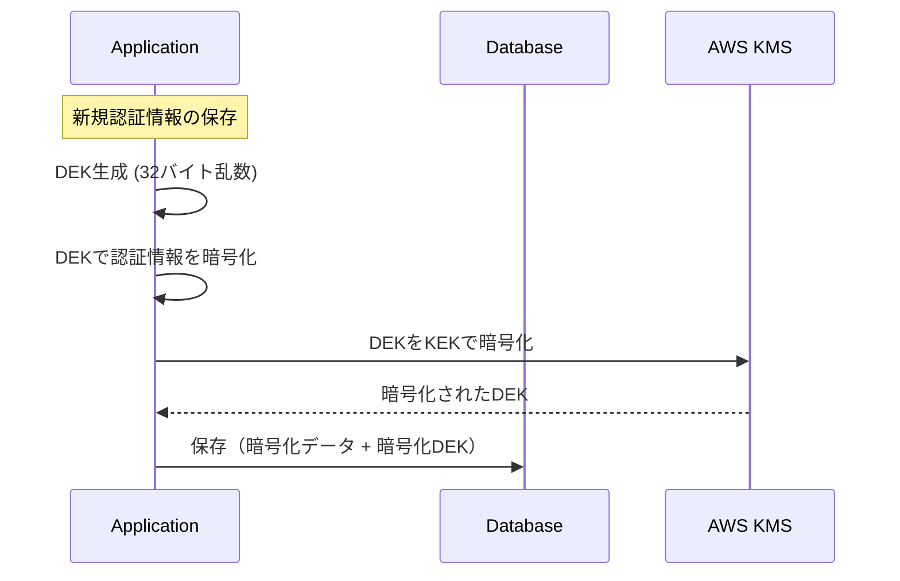
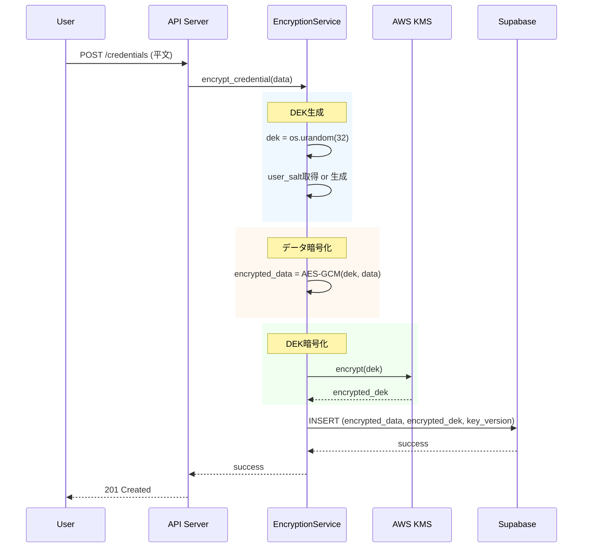
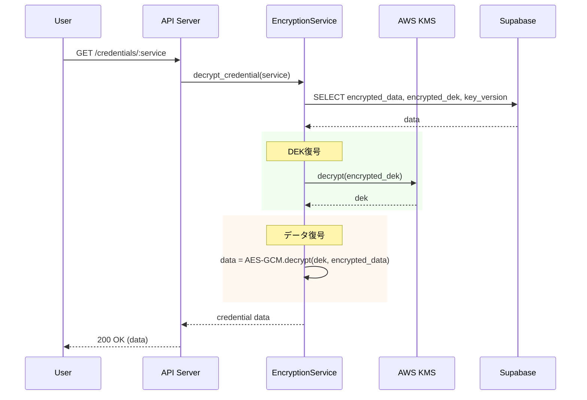
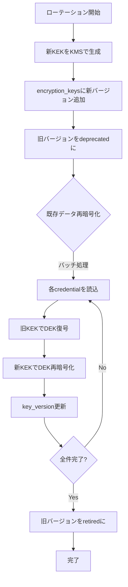

# 暗号化基盤 Phase 2-3 設計書

> **Version**: 1.0.0
> **Created**: 2026-01-28
> **Author**: System Design Team
> **Status**: Draft

---

## 目次

1. [現状分析](#1-現状分析)
2. [エンベロープ暗号化（KEK/DEK分離）設計](#2-エンベロープ暗号化kekdek分離設計)
3. [ユーザー固有ソルト設計](#3-ユーザー固有ソルト設計)
4. [キーバージョン管理設計](#4-キーバージョン管理設計)
5. [既存データのマイグレーション計画](#5-既存データのマイグレーション計画)
6. [テーブル構造の整理](#6-テーブル構造の整理)
7. [実装ロードマップ](#7-実装ロードマップ)

---

## 1. 現状分析

### 1.1 現在の暗号化実装

**ファイル**: `/mnt/d/done/app/services/encryption.py`

```
暗号化方式: Fernet (AES-128-CBC + HMAC-SHA256)
キー派生:   PBKDF2HMAC (SHA256, 100,000 iterations)
ソルト:     固定値 b"ai_secretary_salt"
```

### 1.2 現在の問題点

| 問題 | 影響度 | 説明 |
|------|--------|------|
| 固定ソルト | **高** | 全ユーザーで同一ソルト。レインボーテーブル攻撃に脆弱 |
| 単一暗号化キー | **高** | KEK/DEK分離なし。キー漏洩時に全データ復号可能 |
| キーバージョンなし | **中** | キーローテーション不可。PCI DSS非準拠 |
| テーブル重複 | **低** | `credentials` と `user_credentials` が重複 |

### 1.3 現在のテーブル構造

```sql
-- credentials（001_initial_schema.sql）
CREATE TABLE credentials (
    id UUID PRIMARY KEY,
    user_id UUID NOT NULL REFERENCES users(id),
    service_name VARCHAR(100) NOT NULL,
    encrypted_data TEXT NOT NULL,
    created_at TIMESTAMP WITH TIME ZONE,
    updated_at TIMESTAMP WITH TIME ZONE,
    UNIQUE(user_id, service_name)
);

-- user_credentials（004_execution_engine.sql）★重複
CREATE TABLE user_credentials (
    id UUID PRIMARY KEY,
    user_id UUID NOT NULL,
    service VARCHAR(50) NOT NULL,
    encrypted_data TEXT NOT NULL,
    created_at TIMESTAMP WITH TIME ZONE,
    updated_at TIMESTAMP WITH TIME ZONE,
    UNIQUE(user_id, service)
);
```

---

## 2. エンベロープ暗号化（KEK/DEK分離）設計

### 2.1 概要

エンベロープ暗号化では、データ暗号化キー（DEK）でデータを暗号化し、
キー暗号化キー（KEK）でDEKを暗号化する二重構造を採用する。

```
┌─────────────────────────────────────────────────────────────┐
│                    エンベロープ暗号化                        │
├─────────────────────────────────────────────────────────────┤
│                                                             │
│   ┌─────────┐         ┌─────────┐         ┌─────────────┐  │
│   │  KEK    │ 暗号化  │  DEK    │ 暗号化  │  認証情報   │  │
│   │ (KMS)   │───────>│(ランダム)│───────>│(credentials)│  │
│   └─────────┘         └─────────┘         └─────────────┘  │
│       │                    │                    │          │
│       │                    │                    │          │
│       ▼                    ▼                    ▼          │
│   KMSで安全に        暗号化してDBに        暗号化してDBに    │
│   保管               保存                  保存              │
│                                                             │
└─────────────────────────────────────────────────────────────┘
```

### 2.2 KEK（キー暗号化キー）管理

#### 推奨KMSオプション

| KMS | 特徴 | コスト | 推奨度 |
|-----|------|--------|--------|
| **AWS KMS** | マネージド、自動ローテーション | $1/月/キー + API呼び出し | ★★★ |
| **Azure Key Vault** | Azure統合、FIPS 140-2 Level 2 | 類似 | ★★★ |
| **HashiCorp Vault** | セルフホスト可、柔軟性高 | 無料（OSS）/ 有料 | ★★☆ |
| **GCP Cloud KMS** | GCP統合、グローバル | 類似 | ★★★ |

#### AWS KMS設定例

```python
import boto3
from botocore.config import Config

class KEKManager:
    """KEK管理クラス（AWS KMS使用）"""

    def __init__(self, key_id: str, region: str = "ap-northeast-1"):
        self.kms = boto3.client(
            'kms',
            region_name=region,
            config=Config(retries={'max_attempts': 3})
        )
        self.key_id = key_id  # KMSキーID or ARN

    def encrypt_dek(self, dek: bytes) -> bytes:
        """DEKをKEKで暗号化"""
        response = self.kms.encrypt(
            KeyId=self.key_id,
            Plaintext=dek,
            EncryptionContext={'purpose': 'dek_encryption'}
        )
        return response['CiphertextBlob']

    def decrypt_dek(self, encrypted_dek: bytes) -> bytes:
        """暗号化されたDEKを復号"""
        response = self.kms.decrypt(
            CiphertextBlob=encrypted_dek,
            EncryptionContext={'purpose': 'dek_encryption'}
        )
        return response['Plaintext']
```

### 2.3 DEK（データ暗号化キー）管理

#### DEK生成フロー



#### DEK生成コード

```python
import os
from cryptography.hazmat.primitives.ciphers.aead import AESGCM

class DEKManager:
    """DEK管理クラス"""

    @staticmethod
    def generate_dek() -> bytes:
        """新しいDEKを生成（256ビット）"""
        return os.urandom(32)

    @staticmethod
    def encrypt_data(dek: bytes, plaintext: bytes, aad: bytes = None) -> bytes:
        """データをDEKで暗号化（AES-256-GCM）"""
        aesgcm = AESGCM(dek)
        nonce = os.urandom(12)  # 96ビットnonce
        ciphertext = aesgcm.encrypt(nonce, plaintext, aad)
        return nonce + ciphertext  # nonce + ciphertext + tag

    @staticmethod
    def decrypt_data(dek: bytes, encrypted: bytes, aad: bytes = None) -> bytes:
        """暗号化データを復号"""
        aesgcm = AESGCM(dek)
        nonce = encrypted[:12]
        ciphertext = encrypted[12:]
        return aesgcm.decrypt(nonce, ciphertext, aad)
```

### 2.4 暗号化/復号シーケンス図

#### 暗号化フロー



#### 復号フロー



---

## 3. ユーザー固有ソルト設計

### 3.1 ソルト仕様

| 項目 | 値 |
|------|-----|
| 長さ | 32バイト（256ビット） |
| 生成方法 | `os.urandom(32)` |
| 保存場所 | `users.encryption_salt` カラム |
| 生成タイミング | ユーザー作成時 |

### 3.2 ソルト生成コード

```python
import os
import base64

def generate_user_salt() -> str:
    """ユーザー固有ソルトを生成（Base64エンコード）"""
    salt_bytes = os.urandom(32)
    return base64.b64encode(salt_bytes).decode('utf-8')

def get_user_salt(user_id: str, supabase_client) -> bytes:
    """ユーザーのソルトを取得（なければ生成）"""
    result = supabase_client.table("users").select("encryption_salt").eq("id", user_id).execute()

    if result.data and result.data[0].get("encryption_salt"):
        return base64.b64decode(result.data[0]["encryption_salt"])

    # ソルトがない場合は生成して保存
    new_salt = generate_user_salt()
    supabase_client.table("users").update(
        {"encryption_salt": new_salt}
    ).eq("id", user_id).execute()

    return base64.b64decode(new_salt)
```

### 3.3 ソルトの用途

```
1. DEK派生時のAAD（Additional Authenticated Data）として使用
2. キー識別子の一部として使用（user_id + salt + service）
3. 同一サービスでも異なるユーザーは異なる暗号化結果に
```

---

## 4. キーバージョン管理設計

### 4.1 バージョン管理方式

```
フォーマット: v{major}.{timestamp}
例: v1.1706428800

major: メジャーバージョン（KEK変更時にインクリメント）
timestamp: Unix timestamp（自動ローテーション識別用）
```

### 4.2 キーバージョンテーブル

```sql
CREATE TABLE encryption_keys (
    id UUID PRIMARY KEY DEFAULT uuid_generate_v4(),
    version VARCHAR(50) NOT NULL UNIQUE,
    kms_key_id VARCHAR(255) NOT NULL,    -- KMSキーのARN/ID
    algorithm VARCHAR(50) DEFAULT 'AES-256-GCM',
    status VARCHAR(20) DEFAULT 'active', -- active, deprecated, retired
    created_at TIMESTAMP WITH TIME ZONE DEFAULT NOW(),
    retired_at TIMESTAMP WITH TIME ZONE,
    metadata JSONB
);

-- インデックス
CREATE INDEX idx_encryption_keys_version ON encryption_keys(version);
CREATE INDEX idx_encryption_keys_status ON encryption_keys(status);
```

### 4.3 キーローテーションフロー



### 4.4 キーローテーショントリガー条件

| トリガー | 頻度/条件 |
|----------|-----------|
| 定期ローテーション | 90日ごと（PCI DSS推奨） |
| セキュリティインシデント | 即時 |
| コンプライアンス要件 | 監査指摘時 |
| 従業員退職 | キーアクセス権を持つ者の退職時 |

### 4.5 複数バージョン対応の復号

```python
class MultiVersionDecryptor:
    """複数キーバージョン対応の復号処理"""

    def __init__(self, kek_manager: KEKManager):
        self.kek_manager = kek_manager
        self._key_cache = {}

    async def decrypt_credential(
        self,
        encrypted_data: bytes,
        encrypted_dek: bytes,
        key_version: str
    ) -> dict:
        """キーバージョンに応じた復号"""

        # キーバージョンに対応するKMSキーIDを取得
        kms_key_id = await self._get_kms_key_id(key_version)

        # DEKを復号
        dek = self.kek_manager.decrypt_dek(encrypted_dek, kms_key_id)

        # データを復号
        plaintext = DEKManager.decrypt_data(dek, encrypted_data)

        return json.loads(plaintext)

    async def _get_kms_key_id(self, key_version: str) -> str:
        """バージョンからKMSキーIDを取得"""
        if key_version in self._key_cache:
            return self._key_cache[key_version]

        result = await self.supabase.table("encryption_keys")\
            .select("kms_key_id")\
            .eq("version", key_version)\
            .execute()

        if not result.data:
            raise ValueError(f"Unknown key version: {key_version}")

        kms_key_id = result.data[0]["kms_key_id"]
        self._key_cache[key_version] = kms_key_id
        return kms_key_id
```

---

## 5. 既存データのマイグレーション計画

### 5.1 マイグレーション概要

```
┌───────────────────────────────────────────────────────────────┐
│                    マイグレーション戦略                        │
├───────────────────────────────────────────────────────────────┤
│                                                               │
│  Phase 1: 準備（ダウンタイムなし）                            │
│  ├─ 新テーブル作成                                           │
│  ├─ 新暗号化サービスデプロイ                                 │
│  └─ 読み取りは両方対応                                       │
│                                                               │
│  Phase 2: 移行（ダウンタイムなし）                            │
│  ├─ バックグラウンドで順次再暗号化                           │
│  ├─ 新規データは新方式で保存                                 │
│  └─ 進捗をモニタリング                                       │
│                                                               │
│  Phase 3: 完了（ダウンタイムなし）                            │
│  ├─ 旧テーブル削除                                           │
│  └─ 旧暗号化コード削除                                       │
│                                                               │
└───────────────────────────────────────────────────────────────┘
```

### 5.2 段階的移行手順

#### Phase 1: 準備（Week 1）

```sql
-- 1. ユーザーテーブルにソルト追加
ALTER TABLE users ADD COLUMN encryption_salt VARCHAR(64);

-- 2. 暗号化キーテーブル作成
CREATE TABLE encryption_keys (...);  -- 4.2参照

-- 3. 認証情報テーブル拡張
ALTER TABLE credentials ADD COLUMN encrypted_dek TEXT;
ALTER TABLE credentials ADD COLUMN key_version VARCHAR(50);
ALTER TABLE credentials ADD COLUMN migration_status VARCHAR(20) DEFAULT 'pending';

-- 4. 初期KEKをKMSで作成・登録
INSERT INTO encryption_keys (version, kms_key_id, status)
VALUES ('v1.1706428800', 'arn:aws:kms:ap-northeast-1:xxx:key/xxx', 'active');
```

#### Phase 2: 移行（Week 2-3）

```python
async def migrate_credential(credential_id: str):
    """単一認証情報の移行"""

    # 1. 旧方式で復号
    old_service = get_encryption_service()  # 旧サービス
    credential = await get_credential_by_id(credential_id)
    plaintext = old_service.decrypt(credential.encrypted_data)

    # 2. ユーザーソルト取得/生成
    user_salt = await get_user_salt(credential.user_id)

    # 3. 新DEK生成
    dek = DEKManager.generate_dek()

    # 4. 新方式で暗号化
    new_encrypted_data = DEKManager.encrypt_data(
        dek,
        plaintext.encode(),
        aad=user_salt
    )

    # 5. DEKをKEKで暗号化
    encrypted_dek = kek_manager.encrypt_dek(dek)

    # 6. 更新
    await supabase.table("credentials").update({
        "encrypted_data": base64.b64encode(new_encrypted_data).decode(),
        "encrypted_dek": base64.b64encode(encrypted_dek).decode(),
        "key_version": "v1.1706428800",
        "migration_status": "completed"
    }).eq("id", credential_id).execute()

async def run_migration_batch(batch_size: int = 100):
    """バッチ移行処理"""
    while True:
        # 未移行の認証情報を取得
        result = await supabase.table("credentials")\
            .select("id")\
            .eq("migration_status", "pending")\
            .limit(batch_size)\
            .execute()

        if not result.data:
            break

        for row in result.data:
            try:
                await migrate_credential(row["id"])
            except Exception as e:
                logger.error(f"Migration failed for {row['id']}: {e}")
                # 失敗したものはfailed_atに記録して後で対処

        await asyncio.sleep(1)  # レート制限
```

#### Phase 3: 完了（Week 4）

```sql
-- 1. 未移行データがないことを確認
SELECT COUNT(*) FROM credentials WHERE migration_status != 'completed';

-- 2. 移行カラム削除
ALTER TABLE credentials DROP COLUMN migration_status;

-- 3. user_credentialsテーブル削除（統合完了後）
DROP TABLE user_credentials;
```

### 5.3 ロールバック計画

```python
async def rollback_credential(credential_id: str):
    """認証情報のロールバック"""

    # 1. 新方式で復号
    credential = await get_credential_by_id(credential_id)
    plaintext = await new_encryption_service.decrypt(
        credential.encrypted_data,
        credential.encrypted_dek,
        credential.key_version
    )

    # 2. 旧方式で再暗号化
    old_encrypted = old_encryption_service.encrypt(plaintext)

    # 3. 更新
    await supabase.table("credentials").update({
        "encrypted_data": old_encrypted,
        "encrypted_dek": None,
        "key_version": None,
        "migration_status": "rolled_back"
    }).eq("id", credential_id).execute()
```

### 5.4 ダウンタイム

```
想定ダウンタイム: 0分

理由:
- 新旧両方の暗号化方式に対応したサービスを先にデプロイ
- key_versionの有無で自動判定
- バックグラウンドで順次移行
```

---

## 6. テーブル構造の整理

### 6.1 統合案: credentials と user_credentials

```
現状:
├── credentials（001_initial_schema.sql）
│   └── user_id → users.id（FK）
│
└── user_credentials（004_execution_engine.sql）
    └── user_id（FKなし）★問題

統合後:
└── credentials（統一）
    └── user_id → users.id（FK）
    └── encrypted_dek, key_version 追加
```

### 6.2 新テーブル構造

```sql
-- ==================== 統合版 credentials テーブル ====================
CREATE TABLE credentials_v2 (
    id UUID PRIMARY KEY DEFAULT uuid_generate_v4(),

    -- ユーザー関連
    user_id UUID NOT NULL REFERENCES users(id) ON DELETE CASCADE,

    -- サービス情報
    service_name VARCHAR(100) NOT NULL,
    credential_type VARCHAR(50) DEFAULT 'login',  -- login, api_key, oauth, imap

    -- 暗号化データ
    encrypted_data TEXT NOT NULL,           -- AES-256-GCM暗号化されたJSON
    encrypted_dek TEXT NOT NULL,            -- KEKで暗号化されたDEK
    key_version VARCHAR(50) NOT NULL,       -- 使用したキーバージョン

    -- メタデータ
    last_used_at TIMESTAMP WITH TIME ZONE,
    created_at TIMESTAMP WITH TIME ZONE DEFAULT NOW(),
    updated_at TIMESTAMP WITH TIME ZONE DEFAULT NOW(),

    -- 制約
    UNIQUE(user_id, service_name)
);

-- インデックス
CREATE INDEX idx_credentials_v2_user_service ON credentials_v2(user_id, service_name);
CREATE INDEX idx_credentials_v2_key_version ON credentials_v2(key_version);

-- RLS
ALTER TABLE credentials_v2 ENABLE ROW LEVEL SECURITY;

CREATE POLICY "Users can manage own credentials"
    ON credentials_v2 FOR ALL
    USING (auth.uid() = user_id);

CREATE POLICY "Service role full access"
    ON credentials_v2 FOR ALL
    TO service_role
    USING (true);
```

### 6.3 encryption_keys テーブル

```sql
-- ==================== 暗号化キー管理テーブル ====================
CREATE TABLE encryption_keys (
    id UUID PRIMARY KEY DEFAULT uuid_generate_v4(),

    -- キー情報
    version VARCHAR(50) NOT NULL UNIQUE,
    kms_key_id VARCHAR(255) NOT NULL,       -- KMSキーのARN/ID
    kms_provider VARCHAR(50) DEFAULT 'aws', -- aws, azure, gcp, vault
    algorithm VARCHAR(50) DEFAULT 'AES-256-GCM',

    -- 状態管理
    status VARCHAR(20) DEFAULT 'active',    -- active, deprecated, retired

    -- タイムスタンプ
    created_at TIMESTAMP WITH TIME ZONE DEFAULT NOW(),
    deprecated_at TIMESTAMP WITH TIME ZONE,
    retired_at TIMESTAMP WITH TIME ZONE,

    -- メタデータ
    metadata JSONB,

    -- 制約
    CHECK (status IN ('active', 'deprecated', 'retired'))
);

-- インデックス
CREATE INDEX idx_encryption_keys_status ON encryption_keys(status);
CREATE INDEX idx_encryption_keys_version ON encryption_keys(version);

-- コメント
COMMENT ON TABLE encryption_keys IS 'KEK（キー暗号化キー）のバージョン管理';
COMMENT ON COLUMN encryption_keys.status IS 'active: 新規暗号化に使用, deprecated: 復号のみ, retired: 使用不可';
```

### 6.4 users テーブル拡張

```sql
-- ユーザーテーブルにソルトカラム追加
ALTER TABLE users ADD COLUMN IF NOT EXISTS encryption_salt VARCHAR(64);

-- 既存ユーザーにソルト生成（マイグレーション時に実行）
-- アプリケーションレベルで実施
```

### 6.5 マイグレーションSQL全体

```sql
-- ==================== Migration: 015_encryption_enhancement.sql ====================

-- 1. usersテーブル拡張
ALTER TABLE users ADD COLUMN IF NOT EXISTS encryption_salt VARCHAR(64);

-- 2. encryption_keysテーブル作成
CREATE TABLE IF NOT EXISTS encryption_keys (
    id UUID PRIMARY KEY DEFAULT uuid_generate_v4(),
    version VARCHAR(50) NOT NULL UNIQUE,
    kms_key_id VARCHAR(255) NOT NULL,
    kms_provider VARCHAR(50) DEFAULT 'aws',
    algorithm VARCHAR(50) DEFAULT 'AES-256-GCM',
    status VARCHAR(20) DEFAULT 'active',
    created_at TIMESTAMP WITH TIME ZONE DEFAULT NOW(),
    deprecated_at TIMESTAMP WITH TIME ZONE,
    retired_at TIMESTAMP WITH TIME ZONE,
    metadata JSONB,
    CHECK (status IN ('active', 'deprecated', 'retired'))
);

CREATE INDEX IF NOT EXISTS idx_encryption_keys_status ON encryption_keys(status);
CREATE INDEX IF NOT EXISTS idx_encryption_keys_version ON encryption_keys(version);

-- 3. credentialsテーブル拡張（既存データ保持）
ALTER TABLE credentials ADD COLUMN IF NOT EXISTS encrypted_dek TEXT;
ALTER TABLE credentials ADD COLUMN IF NOT EXISTS key_version VARCHAR(50);
ALTER TABLE credentials ADD COLUMN IF NOT EXISTS credential_type VARCHAR(50) DEFAULT 'login';
ALTER TABLE credentials ADD COLUMN IF NOT EXISTS last_used_at TIMESTAMP WITH TIME ZONE;
ALTER TABLE credentials ADD COLUMN IF NOT EXISTS migration_status VARCHAR(20) DEFAULT 'pending';

-- 4. インデックス追加
CREATE INDEX IF NOT EXISTS idx_credentials_key_version ON credentials(key_version);
CREATE INDEX IF NOT EXISTS idx_credentials_migration ON credentials(migration_status)
    WHERE migration_status != 'completed';

-- 5. user_credentialsのデータをcredentialsに移行
INSERT INTO credentials (user_id, service_name, encrypted_data, credential_type, created_at, updated_at)
SELECT
    user_id,
    service AS service_name,
    encrypted_data,
    'login' AS credential_type,
    created_at,
    updated_at
FROM user_credentials
ON CONFLICT (user_id, service_name)
DO UPDATE SET
    encrypted_data = EXCLUDED.encrypted_data,
    updated_at = NOW();

-- 6. 完了後にuser_credentialsを削除（Phase 3で実行）
-- DROP TABLE IF EXISTS user_credentials;

-- コメント
COMMENT ON TABLE encryption_keys IS 'KEK（キー暗号化キー）のバージョン管理';
COMMENT ON COLUMN credentials.encrypted_dek IS 'KEKで暗号化されたDEK（エンベロープ暗号化）';
COMMENT ON COLUMN credentials.key_version IS '使用したencryption_keysのバージョン';
COMMENT ON COLUMN users.encryption_salt IS 'ユーザー固有の暗号化ソルト（32バイト、Base64）';
```

---

## 7. 実装ロードマップ

### 7.1 フェーズ別計画

```
Phase 1: インフラ準備
├─ AWS KMS キー作成
├─ encryption_keys テーブル作成
├─ users.encryption_salt 追加
└─ 新EncryptionService実装

Phase 2: 並行運用
├─ 新旧両対応のサービスデプロイ
├─ 新規データは新方式で保存
├─ 既存データは読み取り時に自動判定
└─ バックグラウンド移行開始

Phase 3: 移行完了
├─ 全データの移行完了確認
├─ user_credentials テーブル削除
├─ 旧暗号化コード削除
└─ ドキュメント更新
```

### 7.2 実装チェックリスト

- [ ] AWS KMS キー作成・設定
- [ ] encryption_keys テーブル作成
- [ ] KEKManager クラス実装
- [ ] DEKManager クラス実装
- [ ] MultiVersionDecryptor 実装
- [ ] ユーザーソルト生成・管理実装
- [ ] マイグレーションスクリプト作成
- [ ] ロールバックスクリプト作成
- [ ] 単体テスト作成
- [ ] 統合テスト作成
- [ ] 本番移行実行
- [ ] 監視・アラート設定

---

## 付録A: セキュリティ考慮事項

### A.1 暗号化アルゴリズム選択根拠

| アルゴリズム | 用途 | 根拠 |
|-------------|------|------|
| AES-256-GCM | データ暗号化 | NIST推奨、認証付き暗号化 |
| PBKDF2-SHA256 | キー派生（レガシー） | FIPS 140-2準拠 |
| KMS | KEK管理 | HSM保護、監査ログ |

### A.2 鍵管理ベストプラクティス

1. **分離の原則**: KEKとDEKを分離し、異なるアクセス制御を適用
2. **最小権限**: KMSへのアクセスは必要最小限のIAMロールのみ
3. **監査ログ**: 全てのキー操作をCloudTrailで記録
4. **自動ローテーション**: KMSの自動ローテーション機能を有効化

---

## 付録B: 関連ドキュメント

- [AWS KMS Developer Guide](https://docs.aws.amazon.com/kms/latest/developerguide/)
- [OWASP Cryptographic Storage Cheat Sheet](https://cheatsheetseries.owasp.org/cheatsheets/Cryptographic_Storage_Cheat_Sheet.html)
- [PCI DSS Requirement 3: Protect Stored Data](https://www.pcisecuritystandards.org/)

---

*Document End*
