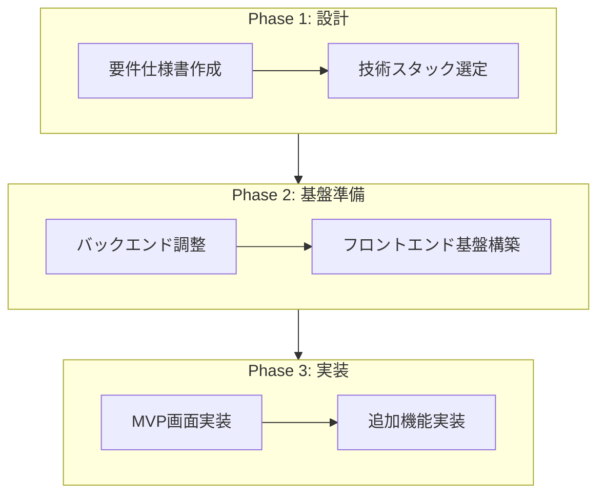
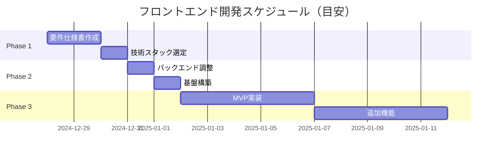

# フロントエンド開発計画

> AI秘書システム「Done」のフロントエンド開発に向けた計画書

## 開発フロー概要



---

## Phase 1: 設計

### 1.1 要件仕様書作成

| 項目 | 詳細 |
|------|------|
| **担当** | ユーザー |
| **成果物** | `docs/frontend_requirements.md` |
| **目安時間** | 1〜2時間 |

**作業内容:**
- 画面一覧の洗い出し
- 各画面の機能要件定義
- 優先度設定（MVP / Phase 2 / 将来）
- デザイン方針の決定

**テンプレート:** [`docs/frontend_requirements_template.md`](./frontend_requirements_template.md)

---

### 1.2 技術スタック選定

| 項目 | 詳細 |
|------|------|
| **担当** | ユーザー + AI（共同） |
| **成果物** | 技術スタック決定 |
| **目安時間** | 30分〜1時間 |

**検討項目:**

| カテゴリ | 候補 | 備考 |
|----------|------|------|
| フレームワーク | Next.js 14+ (App Router) | React Server Components対応 |
| 言語 | TypeScript | 型安全性確保 |
| スタイリング | Tailwind CSS | ユーティリティファースト |
| UIライブラリ | shadcn/ui or Radix UI | アクセシビリティ対応 |
| 状態管理 | Zustand + TanStack Query | シンプル + サーバー状態管理 |
| フォーム | React Hook Form + Zod | バリデーション統合 |
| リアルタイム | Native WebSocket | チャット用 |

---

## Phase 2: 基盤準備

### 2.1 バックエンド調整

| 項目 | 詳細 |
|------|------|
| **担当** | AI |
| **成果物** | Cookie認証 + リフレッシュトークン対応 |
| **目安時間** | 2〜3時間 |

**作業内容:**

1. **Cookie認証への変更**
   - ログインAPIでHttpOnly Cookieを発行
   - 既存のBearer認証との互換性維持（オプション）

2. **リフレッシュトークン実装**
   - リフレッシュトークン生成・保存
   - `/api/v1/chat/refresh` エンドポイント追加
   - トークンローテーション対応

3. **セキュリティ対策**
   - CSRF対策（SameSite設定）
   - Secure属性（本番環境）

---

### 2.2 フロントエンド基盤構築

| 項目 | 詳細 |
|------|------|
| **担当** | AI |
| **成果物** | フロントエンドプロジェクト初期構成 |
| **目安時間** | 2〜3時間 |

**作業内容:**

1. **プロジェクト初期化**
   ```
   frontend/
   ├── src/
   │   ├── app/           # Next.js App Router
   │   ├── components/    # 共通コンポーネント
   │   ├── features/      # 機能別モジュール
   │   ├── lib/           # ユーティリティ
   │   └── types/         # 型定義
   ├── package.json
   └── ...
   ```

2. **OpenAPIから型生成**
   - `openapi.json` から TypeScript 型を自動生成
   - 型安全なAPIクライアント作成

3. **認証フロー実装**
   - ログイン/ログアウト処理
   - セッション状態管理
   - 保護ルート実装

4. **共通コンポーネント**
   - レイアウト（ヘッダー、ナビゲーション）
   - ローディング/エラー表示
   - 共通UI部品

---

## Phase 3: 実装

### 3.1 MVP画面実装

| 項目 | 詳細 |
|------|------|
| **担当** | AI |
| **目安時間** | 要件仕様書の内容次第 |

**想定される優先画面:**

| 画面 | 説明 | 複雑度 |
|------|------|--------|
| ログイン/登録 | 認証画面 | 低 |
| ダンページ | AI秘書との1対1チャット | 高 |
| タスク実行状況 | リアルタイム進捗表示 | 中 |
| 設定 | プロフィール編集など | 低 |

---

### 3.2 追加機能実装

MVP完成後、要件仕様書のPhase 2以降の機能を順次実装。

---

## マイルストーン



---

## チェックリスト

### Phase 1 完了条件
- [ ] 要件仕様書が完成している
- [ ] 技術スタックが決定している

### Phase 2 完了条件
- [ ] Cookie認証が動作する
- [ ] リフレッシュトークンが機能する
- [ ] フロントエンドプロジェクトが初期化されている
- [ ] OpenAPIから型が生成されている
- [ ] 認証フローが実装されている

### Phase 3 完了条件
- [ ] MVP画面がすべて実装されている
- [ ] 基本的なE2Eテストが通る
- [ ] レスポンシブ対応が完了している

---

## 次のステップ

1. **今すぐ:** [`frontend_requirements_template.md`](./frontend_requirements_template.md) を複製して `frontend_requirements.md` を作成
2. **記入:** テンプレートの各項目を埋める
3. **共有:** 完成したらAIに共有して技術スタック選定へ

