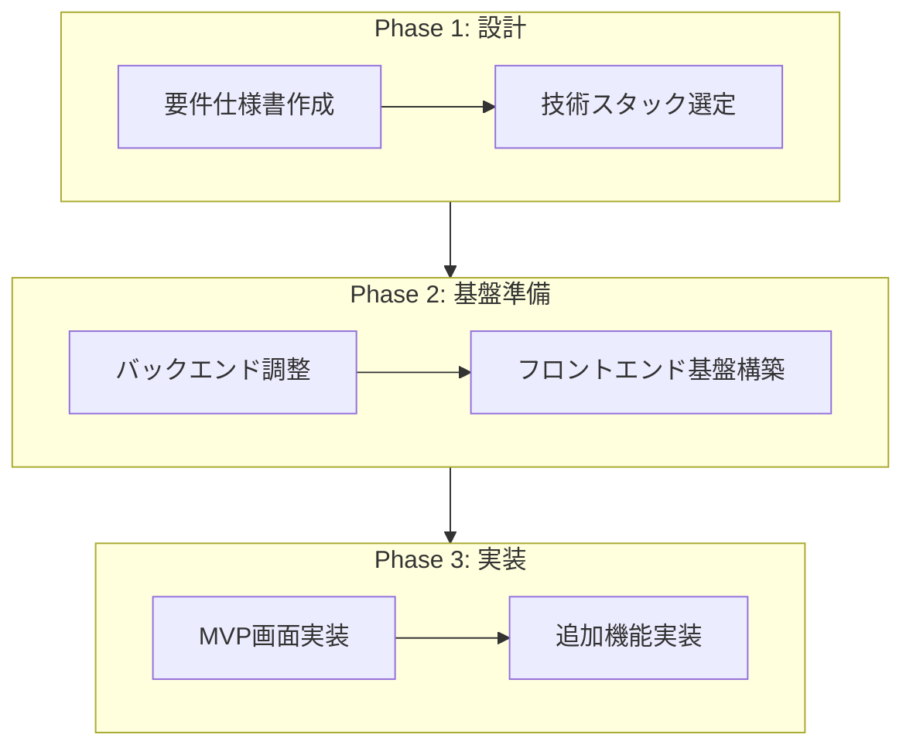

# フロントエンド開発計画

> AI秘書システム「Done」のフロントエンド開発に向けた計画書

## 開発フロー概要



---

## Phase 1: 設計 ✅ 完了

### 1.1 要件仕様書作成 ✅

| 項目 | 詳細 |
|------|------|
| **担当** | ユーザー |
| **成果物** | `docs/frontend_requirements.md` |
| **ステータス** | ✅ 完了 |

---

### 1.2 技術スタック選定 ✅

| 項目 | 詳細 |
|------|------|
| **担当** | ユーザー + AI（共同） |
| **成果物** | 技術スタック決定 |
| **ステータス** | ✅ 完了（2025年12月31日） |

**確定した技術スタック:**

| カテゴリ | 技術 | バージョン |
|----------|------|-----------|
| フレームワーク | Next.js (App Router + Turbopack) | 16.1.1 |
| 言語 | TypeScript | 5.x |
| UIフレームワーク | React | 19.2.3 |
| スタイリング | Tailwind CSS | 4.x |
| UIライブラリ | shadcn/ui (Radix UI) | 最新 |
| 状態管理 | Zustand | 5.x |
| サーバー状態 | TanStack Query | 5.x |
| フォーム | React Hook Form + Zod | 7.x / 4.x |
| アニメーション | Framer Motion | 12.x |
| アイコン | Lucide React | 最新 |
| 多言語対応 | next-intl | 4.x |
| 型生成 | openapi-typescript | 7.x |
| リンター | ESLint + Biome | 最新 |

---

## Phase 2: 基盤準備 ✅ 完了

### 2.1 バックエンド調整 ✅

| 項目 | 詳細 |
|------|------|
| **ステータス** | ✅ 既存実装済み |

バックエンドは既にCookie認証とリフレッシュトークンに対応済み:
- `set_auth_cookies()` / `clear_auth_cookies()` 実装済み
- `/api/v1/chat/refresh` エンドポイント実装済み
- SameSite Cookie設定済み

---

### 2.2 フロントエンド基盤構築 ✅

| 項目 | 詳細 |
|------|------|
| **担当** | AI |
| **成果物** | フロントエンドプロジェクト初期構成 |
| **ステータス** | ✅ 完了 |

**作成したファイル構成:**

```
frontend/
├── src/
│   ├── app/
│   │   ├── layout.tsx           # ルートレイアウト
│   │   ├── globals.css          # ダークモードCSS
│   │   ├── login/page.tsx       # ログイン画面
│   │   ├── register/page.tsx    # 新規登録画面
│   │   ├── chat/page.tsx        # ダンとのチャット画面
│   │   ├── friends/page.tsx     # 友達チャット画面
│   │   └── settings/page.tsx    # 設定画面
│   ├── components/
│   │   ├── ui/                  # shadcn/uiコンポーネント
│   │   ├── layout/              # レイアウトコンポーネント
│   │   │   ├── main-layout.tsx
│   │   │   └── sidebar.tsx
│   │   ├── notification/        # 通知コンポーネント
│   │   │   └── notification-panel.tsx
│   │   └── providers.tsx        # アプリプロバイダー
│   ├── hooks/
│   │   └── use-auth.ts          # 認証フック
│   ├── lib/
│   │   ├── api-client.ts        # 型安全APIクライアント
│   │   ├── query-client.ts      # TanStack Query設定
│   │   └── utils.ts             # ユーティリティ
│   ├── stores/
│   │   └── auth-store.ts        # 認証状態管理
│   ├── types/
│   │   └── api.ts               # OpenAPI生成型
│   └── i18n/
│       ├── ja.json              # 日本語翻訳
│       └── en.json              # 英語翻訳
├── middleware.ts                 # ルート保護
├── biome.json                   # Biome設定
├── package.json
└── tsconfig.json
```

**実装済み機能:**

1. ✅ OpenAPIから型生成（`npm run generate:api`）
2. ✅ 型安全なAPIクライアント
3. ✅ Cookie認証対応
4. ✅ ルート保護ミドルウェア
5. ✅ 認証状態管理（Zustand）
6. ✅ ダークモード専用UI
7. ✅ 共通レイアウト（サイドバー）
8. ✅ 通知コンポーネント
9. ✅ 多言語対応基盤

---

## Phase 3: 実装 🚧 進行中

### 3.1 MVP画面実装

| 画面 | 説明 | ステータス |
|------|------|--------|
| ログイン | 認証画面 | ✅ 完了 |
| 新規登録 | アカウント作成画面 | ✅ 完了 |
| ダンとのチャット | AI秘書との1対1チャット | ✅ 基本実装完了 |
| 友達チャット | 友達とのチャット画面 | ✅ 基本実装完了 |
| 設定 | プロフィール編集など | ✅ 基本実装完了 |
| 通知コンポーネント | 右下の展開可能な通知エリア | ✅ 完了 |
| プロセスモニター | タスク実行状況のリアルタイム表示 | ⬜ 未実装 |

---

### 3.2 追加機能実装

MVP完成後、以下の機能を順次実装:

- [ ] WebSocketリアルタイム通信
- [ ] ファイル・画像添付機能
- [ ] メッセージ編集・削除機能
- [ ] チャット履歴検索
- [ ] ブラウザプッシュ通知
- [ ] プロセスモニター

---

## チェックリスト

### Phase 1 完了条件
- [x] 要件仕様書が完成している
- [x] 技術スタックが決定している

### Phase 2 完了条件
- [x] Cookie認証が動作する（バックエンド既存）
- [x] リフレッシュトークンが機能する（バックエンド既存）
- [x] フロントエンドプロジェクトが初期化されている
- [x] OpenAPIから型が生成されている
- [x] 認証フローが実装されている

### Phase 3 完了条件
- [ ] MVP画面がすべて実装されている
- [ ] 基本的なE2Eテストが通る
- [ ] レスポンシブ対応が完了している

---

## 開発コマンド

```bash
# 開発サーバー起動
cd frontend && npm run dev

# ビルド
npm run build

# 型チェック
npm run typecheck

# リント
npm run lint

# OpenAPI型生成
npm run generate:api
```

---

## 次のステップ

1. **バックエンド起動** - `uvicorn main:app --reload`
2. **フロントエンド起動** - `cd frontend && npm run dev`
3. **動作確認** - http://localhost:3000 にアクセス
4. **残りのMVP機能を実装**
   - プロセスモニター
   - WebSocketリアルタイム通信
