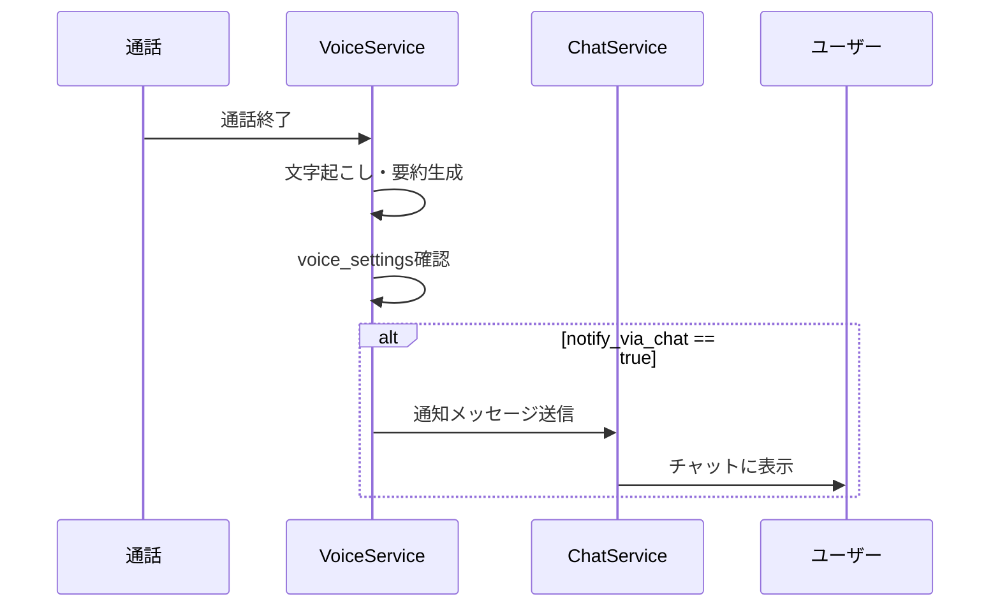
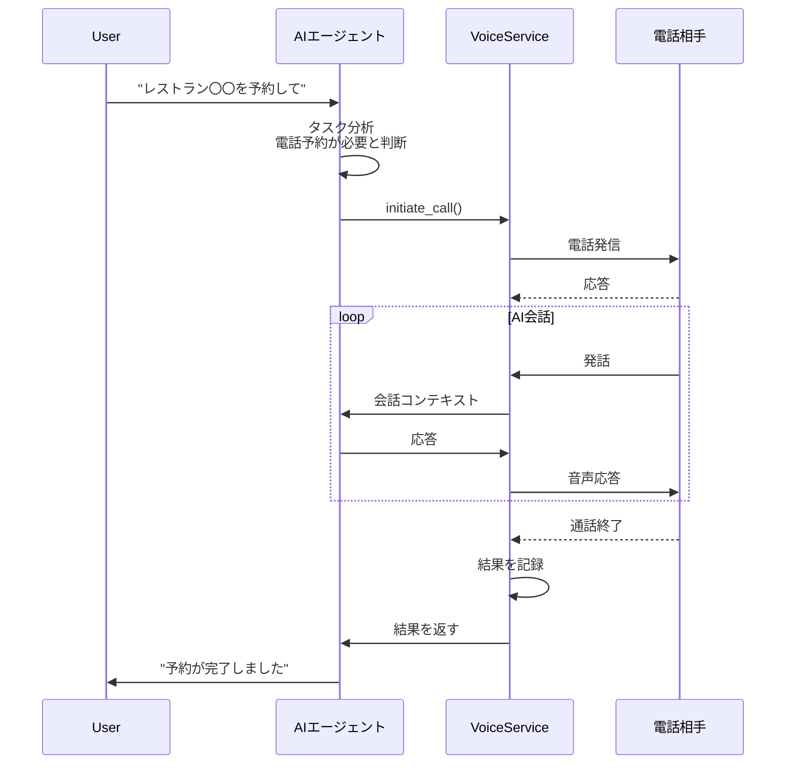

# Phase 10 追加機能: チャット通知・エージェント架電

## 概要

Phase 10の補完機能として、以下を実装する：
1. **通話内容のチャット通知** - 通話終了後にDoneチャットへ通知
2. **エージェントからの自動架電** - AIエージェントがタスク実行時に自動で電話

---

## 1. 通話内容のチャット通知

### 機能概要

通話終了後、以下の情報をDoneチャットに自動送信：
- 通話相手の電話番号
- 通話時間
- 会話の要約
- 必要なアクション（あれば）

### フロー



### 実装詳細

#### VoiceService.notify_chat()

```python
async def notify_chat(
    self,
    user_id: str,
    call: VoiceCallResponse,
) -> None:
    """
    通話内容をチャットに通知
    
    Args:
        user_id: ユーザーID
        call: 通話情報
    """
    # 1. 設定確認
    settings = await self.get_voice_settings(user_id)
    if not settings.notify_via_chat:
        return
    
    # 2. 通知メッセージを構築
    direction_text = "着信" if call.direction == CallDirection.INBOUND else "発信"
    
    message = f"""📞 **{direction_text}通話が終了しました**

相手: {call.from_number if call.direction == CallDirection.INBOUND else call.to_number}
時間: {call.duration_seconds or 0}秒
目的: {call.purpose.value if call.purpose else "不明"}

**要約:**
{call.summary or "（要約なし）"}
"""
    
    # 3. チャットサービスに送信
    from app.services.chat_service import get_chat_service
    chat_service = get_chat_service()
    
    # AIアシスタントとしてメッセージを送信
    await chat_service.send_system_message(
        user_id=user_id,
        message=message,
    )
```

#### ChatService.send_system_message()

```python
async def send_system_message(
    self,
    user_id: str,
    message: str,
) -> None:
    """
    システム/AIからユーザーにメッセージを送信
    
    Args:
        user_id: ユーザーID
        message: メッセージ内容
    """
    # ユーザーのAIルームを取得または作成
    # AIとしてメッセージを投稿
    ...
```

### 実装順序

1. ChatService.send_system_message()実装 → 動作確認 → コミット
2. VoiceService.notify_chat()実装 → 動作確認 → コミット
3. 通話終了時にnotify_chat呼び出し → 動作確認 → コミット
4. 自動テスト追加 → コミット
5. README更新 → コミット

---

## 2. エージェントからの自動架電

### 機能概要

ユーザーが「○○に電話して予約して」と言った時、AIエージェントが自動的に電話をかけて目的を達成する。

### ユースケース

1. **レストラン予約**
   - 「今日19時に4人でレストラン〇〇を予約して」
   - AIが電話をかけて予約

2. **問い合わせ**
   - 「〇〇クリニックの診療時間を電話で確認して」
   - AIが電話して情報を取得

3. **キャンセル連絡**
   - 「明日の美容院の予約をキャンセルして」
   - AIが電話してキャンセル

### フロー



### 実装詳細

#### 1. VoiceExecutor（新規）

```python
# app/executors/voice_executor.py

class VoiceExecutor(BaseExecutor):
    """電話によるタスク実行"""
    
    service_name = "voice"
    
    async def _do_execute(
        self,
        task_id: str,
        search_result: SearchResult,
        credentials: Optional[dict[str, str]] = None,
    ) -> ExecutionResult:
        """
        電話でタスクを実行
        
        Args:
            task_id: タスクID
            search_result: 実行対象（電話番号、目的、コンテキスト）
            
        Returns:
            実行結果
        """
        from app.services.voice_service import get_voice_service
        voice_service = get_voice_service()
        
        # 電話番号と目的を取得
        phone_number = search_result.details.get("phone_number")
        purpose = search_result.details.get("purpose", "inquiry")
        context = search_result.details.get("context", {})
        
        if not phone_number:
            return ExecutionResult(
                success=False,
                message="電話番号が指定されていません",
            )
        
        # 電話発信
        call = await voice_service.initiate_call(
            user_id=search_result.details.get("user_id"),
            to_number=phone_number,
            purpose=CallPurpose(purpose),
            context=context,
            task_id=task_id,
        )
        
        # 通話完了を待機（非同期）
        # TODO: 通話完了イベントを待機する仕組み
        
        return ExecutionResult(
            success=True,
            message=f"電話発信を開始しました: {call.call_sid}",
            details={"call_id": call.id, "call_sid": call.call_sid},
        )
    
    def _requires_login(self) -> bool:
        return False
```

#### 2. ExecutorFactory拡張

```python
# app/executors/base.py の ExecutorFactory に追加

@staticmethod
def get_executor(category: str, service_name: Optional[str] = None) -> BaseExecutor:
    if category == "voice" or category == "phone":
        from app.executors.voice_executor import VoiceExecutor
        return VoiceExecutor()
    # ... 既存のコード
```

#### 3. エージェントの電話タスク判定

```python
# app/agent/agent.py に追加

# タスクタイプに PHONE を追加
class TaskType(str, Enum):
    # ... 既存
    PHONE = "phone"  # 電話タスク

# _analyze_wish で電話タスクを判定
async def _analyze_wish(self, state: AgentState) -> AgentState:
    wish = state["original_wish"]
    wish_lower = wish.lower()
    
    # 電話関連キーワード
    if any(kw in wish_lower for kw in ["電話して", "電話で", "電話をかけて", "架電", "コール"]):
        task_type = TaskType.PHONE
    # ... 既存の判定ロジック
```

#### 4. 電話番号抽出

```python
# エージェントが電話番号を抽出するロジック

import re

def extract_phone_number(text: str) -> Optional[str]:
    """テキストから電話番号を抽出"""
    patterns = [
        r'0\d{1,4}-\d{1,4}-\d{4}',  # 03-1234-5678
        r'0\d{9,10}',                # 0312345678
        r'\+81\d{9,10}',             # +81312345678
    ]
    
    for pattern in patterns:
        match = re.search(pattern, text)
        if match:
            return match.group()
    
    return None
```

### 実装順序

1. VoiceExecutor基本実装 → 動作確認 → コミット
2. ExecutorFactory拡張 → 動作確認 → コミット
3. エージェントのPHONEタスク判定 → 動作確認 → コミット
4. 電話番号抽出ロジック → 動作確認 → コミット
5. 統合テスト → コミット
6. README更新 → コミット

---

## テストケース

### チャット通知

| # | テスト内容 | 期待結果 |
|---|----------|---------|
| 1 | notify_via_chat=true時の通知 | チャットにメッセージが送信される |
| 2 | notify_via_chat=false時 | 通知が送信されない |
| 3 | 通知メッセージの内容 | 要約・相手番号が含まれる |

### エージェント架電

| # | テスト内容 | 期待結果 |
|---|----------|---------|
| 1 | 「電話して」で電話タスク判定 | TaskType.PHONE |
| 2 | VoiceExecutor実行 | 電話発信開始 |
| 3 | 電話番号抽出 | 正しい電話番号 |

---

## 関連ファイル

- `app/services/voice_service.py` - VoiceService
- `app/services/chat_service.py` - ChatService
- `app/executors/voice_executor.py` - VoiceExecutor（新規）
- `app/executors/base.py` - ExecutorFactory
- `app/agent/agent.py` - AIエージェント


