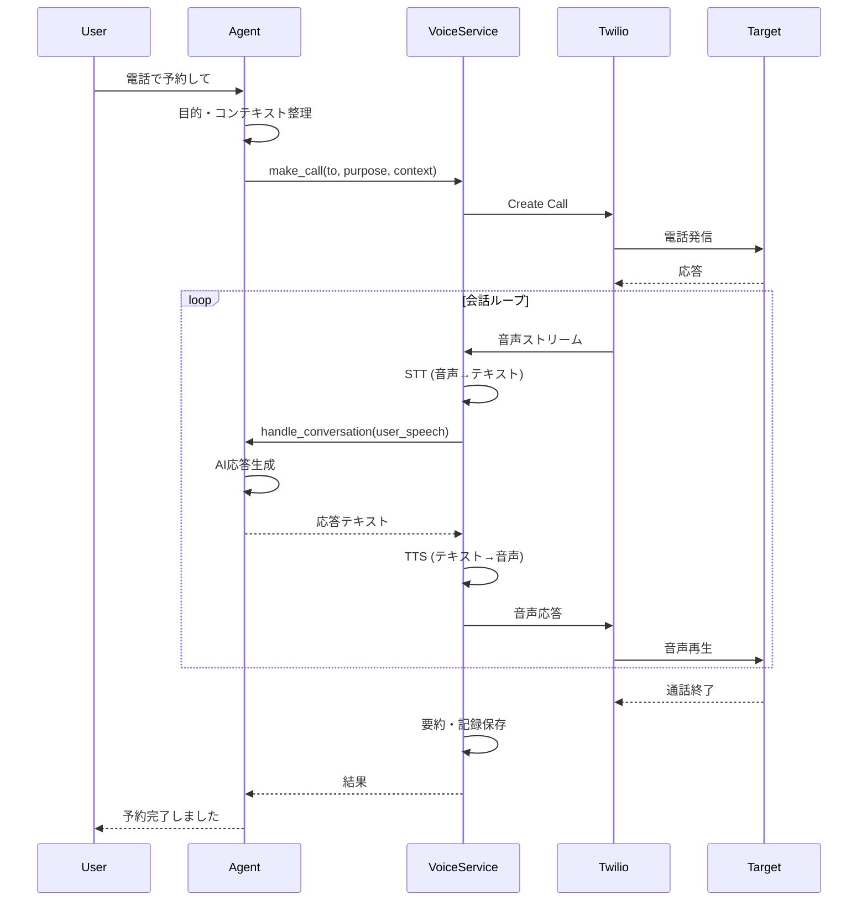
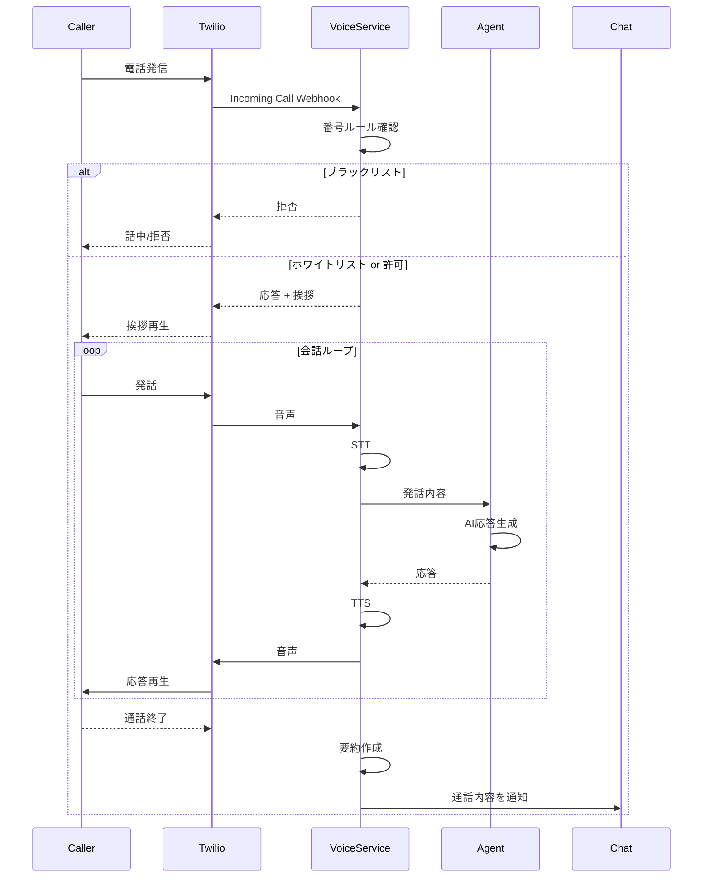
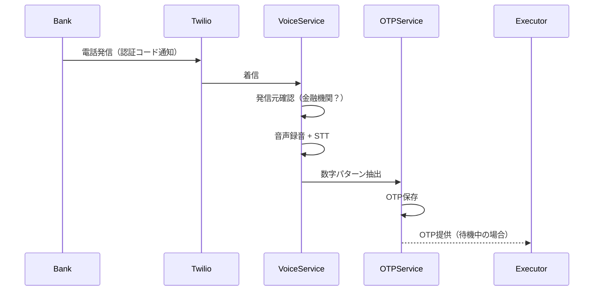

# Phase 10: Voice Communication（音声通話）

## 概要

AIが電話の架電（発信）・受電（着信）を行い、予約・問い合わせ・OTP取得などのタスクを自動化する機能を実装する。
Twilio Voice + ElevenLabs Conversational AIを使用して、高品質な音声で自然な会話を実現する。

## 技術調査結果（2025年12月）

### 採用技術の選定理由

| 選択肢 | 評価 | 採用 |
|-------|------|------|
| **ElevenLabs Conversational AI + Claude** | 最高品質TTS、Claude維持可能、カスタム音声対応、遅延~700-900ms | ✅ **採用** |
| OpenAI Realtime API (gpt-4o-realtime) | STT+LLM+TTS一体型、低遅延（~770ms）、LLMはGPT-4o固定 | ❌ |
| Google STT + Claude + Google TTS | 遅延大きい（1〜3秒）、TTS品質が劣る | ❌ |
| OpenAI Whisper | バッチ処理向け、リアルタイム非対応 | ❌ |

### 選定のポイント

1. **Claude維持**: 既存のチャット・検索・分析と一貫したAI体験
2. **TTS品質**: ElevenLabsは業界最高品質の自然な音声
3. **カスタム音声**: 3000+の音声ライブラリ、ボイスクローン対応
4. **遅延**: OpenAI Realtimeとほぼ同等（~700-900ms）

## Sub-phases

| Sub | 機能 | 説明 | 依存 |
|-----|------|------|------|
| 10A | 技術基盤構築 | Twilio Voice + ElevenLabs設定、基本データモデル | なし |
| 10B | 架電機能 | AIが電話をかけて会話（予約、問い合わせ等） | 10A |
| 10C | 受電機能 | AIが電話を受けて要件を聞き、チャットに連携 | 10A |
| 10D | 電話制御 | 受電オン/オフ、番号ホワイトリスト/ブラックリスト | 10C |

---

## 10A: 技術基盤構築

### 技術スタック

| 機能 | 採用技術 | 理由 |
|------|---------|------|
| 電話API | Twilio Voice | 国内対応、安定性、PSTN接続 |
| 音声認識（STT） | ElevenLabs (内蔵) | Conversational AIに統合 |
| AI会話エンジン | Claude API (既存) | チャット・検索と一貫したAI体験 |
| 音声合成（TTS） | ElevenLabs | 業界最高品質、カスタム音声対応 |

### アーキテクチャ

```
┌─────────────────────────────────────────────────────────────────┐
│                         音声通話システム                          │
├─────────────────────────────────────────────────────────────────┤
│                                                                 │
│  電話網 ←→ Twilio Voice ←→ ElevenLabs Conversational AI        │
│           (PSTN接続)           ↓                                │
│                         ┌─────────────┐                         │
│                         │  STT (内蔵)  │                         │
│                         │      ↓      │                         │
│                         │  Claude API │ ← 既存LLM維持           │
│                         │      ↓      │                         │
│                         │  TTS (内蔵)  │ ← 最高品質音声          │
│                         └─────────────┘                         │
│                                                                 │
├─────────────────────────────────────────────────────────────────┤
│                         既存システム（変更なし）                   │
├─────────────────────────────────────────────────────────────────┤
│  チャット    → Claude API                                       │
│  検索・提案  → Claude API                                       │
│  請求書解析  → Claude API                                       │
│  コンテンツ分類 → Claude API                                    │
└─────────────────────────────────────────────────────────────────┘
```

### 環境変数設定

```env
# Twilio Voice
TWILIO_ACCOUNT_SID=ACxxx
TWILIO_AUTH_TOKEN=xxx
TWILIO_PHONE_NUMBER=+81xxxxxxxxxx

# ElevenLabs
ELEVENLABS_API_KEY=xxx
ELEVENLABS_VOICE_ID=xxx                    # 使用する音声ID
ELEVENLABS_MODEL_ID=eleven_turbo_v2_5      # 低遅延モデル

# Claude API (既存)
ANTHROPIC_API_KEY=xxx

# Voice設定
VOICE_MAX_CALL_DURATION_MINUTES=10
VOICE_DEFAULT_LANGUAGE=ja
VOICE_WEBHOOK_BASE_URL=https://your-domain.com/api/v1/voice/webhook
```

### データモデル

```sql
-- voice_calls: 通話履歴
CREATE TABLE IF NOT EXISTS voice_calls (
    id UUID PRIMARY KEY DEFAULT uuid_generate_v4(),
    user_id UUID NOT NULL,
    call_sid VARCHAR(100) UNIQUE NOT NULL,    -- TwilioのCall SID
    direction VARCHAR(20) NOT NULL,            -- inbound (受電) / outbound (架電)
    status VARCHAR(30) NOT NULL DEFAULT 'initiated',
    from_number VARCHAR(30) NOT NULL,
    to_number VARCHAR(30) NOT NULL,
    started_at TIMESTAMP WITH TIME ZONE DEFAULT NOW(),
    answered_at TIMESTAMP WITH TIME ZONE,
    ended_at TIMESTAMP WITH TIME ZONE,
    duration_seconds INTEGER,
    recording_url TEXT,                        -- 録音URL（オプション）
    transcription TEXT,                        -- 通話内容の文字起こし
    summary TEXT,                              -- AI要約
    purpose VARCHAR(50),                       -- reservation, inquiry, otp_verification等
    task_id UUID,                              -- 関連タスクID
    metadata JSONB DEFAULT '{}',
    created_at TIMESTAMP WITH TIME ZONE DEFAULT NOW(),
    updated_at TIMESTAMP WITH TIME ZONE DEFAULT NOW()
);

-- voice_call_messages: 通話中のメッセージ履歴
CREATE TABLE IF NOT EXISTS voice_call_messages (
    id UUID PRIMARY KEY DEFAULT uuid_generate_v4(),
    call_id UUID NOT NULL REFERENCES voice_calls(id) ON DELETE CASCADE,
    role VARCHAR(20) NOT NULL,                 -- user (相手) / assistant (AI)
    content TEXT NOT NULL,
    timestamp TIMESTAMP WITH TIME ZONE DEFAULT NOW()
);

-- phone_number_rules: 電話番号ルール
CREATE TABLE IF NOT EXISTS phone_number_rules (
    id UUID PRIMARY KEY DEFAULT uuid_generate_v4(),
    user_id UUID NOT NULL,
    phone_number VARCHAR(30) NOT NULL,
    rule_type VARCHAR(20) NOT NULL,            -- whitelist / blacklist
    label VARCHAR(100),                        -- 相手の名前・会社名等
    notes TEXT,
    created_at TIMESTAMP WITH TIME ZONE DEFAULT NOW()
);

-- voice_settings: ユーザー別音声設定
CREATE TABLE IF NOT EXISTS voice_settings (
    id UUID PRIMARY KEY DEFAULT uuid_generate_v4(),
    user_id UUID UNIQUE NOT NULL,
    inbound_enabled BOOLEAN DEFAULT FALSE,     -- 受電を受けるかどうか
    default_greeting TEXT,                     -- デフォルトの挨拶
    auto_answer_whitelist BOOLEAN DEFAULT FALSE,  -- ホワイトリストは自動応答
    record_calls BOOLEAN DEFAULT FALSE,        -- 通話を録音するか
    notify_via_chat BOOLEAN DEFAULT TRUE,      -- チャットに通知するか
    created_at TIMESTAMP WITH TIME ZONE DEFAULT NOW(),
    updated_at TIMESTAMP WITH TIME ZONE DEFAULT NOW()
);

-- Index
CREATE INDEX idx_voice_calls_user ON voice_calls(user_id);
CREATE INDEX idx_voice_calls_status ON voice_calls(status);
CREATE INDEX idx_voice_calls_direction ON voice_calls(direction);
CREATE INDEX idx_phone_number_rules_user ON phone_number_rules(user_id, phone_number);
```

### 通話状態（CallStatus）

```python
class CallStatus(str, Enum):
    INITIATED = "initiated"       # 発信開始
    RINGING = "ringing"           # 呼び出し中
    IN_PROGRESS = "in_progress"   # 通話中
    COMPLETED = "completed"       # 正常終了
    BUSY = "busy"                 # 話し中
    NO_ANSWER = "no_answer"       # 応答なし
    FAILED = "failed"             # 失敗
    CANCELED = "canceled"         # キャンセル
```

### VoiceServiceクラス

```python
# app/services/voice_service.py

class VoiceService:
    """音声通話サービス（ElevenLabs + Claude統合）"""
    
    def __init__(self):
        self.twilio_client = Client(
            settings.TWILIO_ACCOUNT_SID,
            settings.TWILIO_AUTH_TOKEN
        )
        self.elevenlabs_api_key = settings.ELEVENLABS_API_KEY
        self.elevenlabs_voice_id = settings.ELEVENLABS_VOICE_ID
        self.elevenlabs_model_id = settings.ELEVENLABS_MODEL_ID or "eleven_turbo_v2_5"
        
        # Claude API (既存のエージェントを活用)
        from langchain_anthropic import ChatAnthropic
        self.llm = ChatAnthropic(
            model="claude-sonnet-4-20250514",
            api_key=settings.ANTHROPIC_API_KEY,
        )
    
    # === 10A: 基本機能 ===
    async def create_conversation_session(
        self,
        call_id: str,
        purpose: str,
        context: dict,
    ) -> str:
        """
        ElevenLabs Conversational AIセッションを作成
        
        Returns:
            session_id: 会話セッション識別子
        """
        pass
    
    async def speech_to_text(
        self,
        audio_data: bytes,
    ) -> str:
        """
        ElevenLabsのSTTで音声をテキストに変換
        """
        pass
    
    async def generate_response(
        self,
        user_message: str,
        context: dict,
    ) -> str:
        """
        Claudeで応答を生成
        """
        pass
    
    async def text_to_speech(
        self,
        text: str,
        voice_id: Optional[str] = None,
    ) -> bytes:
        """
        ElevenLabsのTTSでテキストを音声に変換
        """
        pass
    
    # === 10B: 架電機能 ===
    async def make_call(
        self,
        user_id: str,
        to_number: str,
        purpose: str,
        context: dict,
        task_id: Optional[str] = None
    ) -> VoiceCall:
        """電話をかける"""
        pass
    
    async def handle_outbound_conversation(
        self,
        call_id: str,
        user_speech: str
    ) -> str:
        """架電中の会話を処理してAI応答を生成"""
        pass
    
    # === 10C: 受電機能 ===
    async def handle_incoming_call(
        self,
        from_number: str,
        to_number: str,
        call_sid: str
    ) -> tuple[bool, str]:
        """着信を処理（応答するかどうかと初期挨拶を返す）"""
        pass
    
    async def handle_inbound_conversation(
        self,
        call_id: str,
        user_speech: str
    ) -> str:
        """受電中の会話を処理してAI応答を生成"""
        pass
    
    async def notify_chat(
        self,
        user_id: str,
        call_summary: str
    ) -> None:
        """通話内容をチャットに通知"""
        pass
    
    # === 10D: 電話制御 ===
    async def check_number_rule(
        self,
        user_id: str,
        phone_number: str
    ) -> Optional[PhoneNumberRule]:
        """電話番号のルールを確認"""
        pass
    
    async def add_phone_rule(
        self,
        user_id: str,
        phone_number: str,
        rule_type: str,
        label: Optional[str] = None
    ) -> PhoneNumberRule:
        """電話番号ルールを追加"""
        pass
    
    # === 共通 ===
    async def get_call(self, call_id: str) -> VoiceCall:
        """通話情報を取得"""
        pass
    
    async def get_call_history(
        self,
        user_id: str,
        limit: int = 20,
        direction: Optional[str] = None
    ) -> List[VoiceCall]:
        """通話履歴を取得"""
        pass
    
    async def end_call(self, call_id: str) -> VoiceCall:
        """通話を終了"""
        pass
```

---

## 10B: 架電機能

### 機能概要

AIが電話をかけて、予約・問い合わせ・確認などのタスクを実行する。
ユーザーからの依頼に基づいて、指定された電話番号に発信し、目的を達成する。

### ユースケース

1. **飲食店予約**: 「今日19時に4人で〇〇レストランを予約して」
2. **問い合わせ**: 「〇〇クリニックの診療時間を電話で確認して」
3. **OTP取得**: 銀行からの電話認証コードを受け取る（Phase 9C連携）
4. **キャンセル連絡**: 「明日の美容院の予約をキャンセルして」

### 架電フロー



### API エンドポイント

#### POST /api/v1/voice/call
架電を開始

**Request Body:**
```json
{
  "to_number": "+81312345678",
  "purpose": "reservation",
  "context": {
    "restaurant_name": "レストラン〇〇",
    "date": "2024-12-25",
    "time": "19:00",
    "party_size": 4,
    "special_requests": "窓際の席希望"
  },
  "task_id": "uuid-..."  // オプション: 関連タスク
}
```

**Response:**
```json
{
  "success": true,
  "call": {
    "id": "uuid-...",
    "call_sid": "CAxxxxx",
    "status": "initiated",
    "to_number": "+81312345678",
    "purpose": "reservation",
    "started_at": "2024-12-25T10:00:00+09:00"
  }
}
```

#### GET /api/v1/voice/call/{id}
通話情報を取得

**Response:**
```json
{
  "call": {
    "id": "uuid-...",
    "call_sid": "CAxxxxx",
    "direction": "outbound",
    "status": "completed",
    "from_number": "+81xxxxxxxxxx",
    "to_number": "+81312345678",
    "started_at": "2024-12-25T10:00:00+09:00",
    "ended_at": "2024-12-25T10:03:30+09:00",
    "duration_seconds": 210,
    "transcription": "こんにちは、レストラン〇〇です...",
    "summary": "12月25日19時に4名で予約完了。窓際席を確保。",
    "purpose": "reservation"
  }
}
```

#### POST /api/v1/voice/call/{id}/end
通話を終了

**Response:**
```json
{
  "success": true,
  "call": {
    "id": "uuid-...",
    "status": "completed",
    "duration_seconds": 210
  }
}
```

#### GET /api/v1/voice/calls
通話履歴を取得

**Query Parameters:**
- `limit`: 取得件数（デフォルト: 20）
- `direction`: inbound / outbound でフィルタ
- `status`: 状態でフィルタ

**Response:**
```json
{
  "calls": [
    {
      "id": "uuid-...",
      "direction": "outbound",
      "status": "completed",
      "to_number": "+81312345678",
      "summary": "レストラン予約完了",
      "duration_seconds": 210,
      "started_at": "2024-12-25T10:00:00+09:00"
    }
  ],
  "total": 15
}
```

### Twilio Webhookエンドポイント

#### POST /api/v1/voice/webhook/status
Twilioからの通話状態更新

**Request (Twilio形式):**
```
CallSid=CAxxxxx&CallStatus=in-progress&...
```

#### POST /api/v1/voice/webhook/gather
音声入力を受信（<Gather>完了時）

#### WebSocket /api/v1/voice/stream
リアルタイム音声ストリーム（Media Streams用）

---

## 10C: 受電機能

### 機能概要

AIが電話を受けて、相手の要件を聞き取り、適切に対応する。
対応結果はチャットに通知され、必要に応じてユーザーに確認を求める。

### ユースケース

1. **不在時応答**: 「ただいま電話に出られません。ご用件をお伺いします」
2. **問い合わせ対応**: よくある質問に自動回答
3. **予約確認**: 「明日の予約の確認でお電話しました」→ AIが応対
4. **緊急連絡**: 重要な用件はすぐにチャットで通知

### 受電フロー



### API エンドポイント

#### POST /api/v1/voice/webhook/incoming
Twilioからの着信通知（Twilio TwiML Webhook）

**Request (Twilio形式):**
```
CallSid=CAxxxxx&From=+81312345678&To=+81xxxxxxxxxx&...
```

**Response (TwiML):**
```xml
<?xml version="1.0" encoding="UTF-8"?>
<Response>
  <Say voice="Google.ja-JP-Neural2-B">
    お電話ありがとうございます。AIアシスタントがご用件をお伺いします。
  </Say>
  <Gather input="speech" language="ja-JP" speechTimeout="auto" action="/api/v1/voice/webhook/gather">
  </Gather>
</Response>
```

#### GET /api/v1/voice/settings
ユーザーの音声設定を取得

**Response:**
```json
{
  "settings": {
    "inbound_enabled": true,
    "default_greeting": "お電話ありがとうございます。ご用件をお伺いします。",
    "auto_answer_whitelist": true,
    "record_calls": false,
    "notify_via_chat": true
  }
}
```

#### PATCH /api/v1/voice/settings
音声設定を更新

**Request Body:**
```json
{
  "inbound_enabled": true,
  "default_greeting": "はい、お電話ありがとうございます。",
  "record_calls": true
}
```

---

## 10D: 電話制御

### 機能概要

着信の許可/拒否を電話番号ベースで制御する。
ホワイトリスト（許可）とブラックリスト（拒否）を管理し、未登録番号のデフォルト動作を設定可能。

### 電話番号ルール

| ルールタイプ | 動作 |
|------------|------|
| whitelist | 自動応答（設定により） |
| blacklist | 着信拒否 |
| （未登録） | 設定に応じて応答/拒否 |

### API エンドポイント

#### GET /api/v1/voice/rules
電話番号ルール一覧を取得

**Query Parameters:**
- `rule_type`: whitelist / blacklist でフィルタ

**Response:**
```json
{
  "rules": [
    {
      "id": "uuid-...",
      "phone_number": "+81312345678",
      "rule_type": "whitelist",
      "label": "〇〇クリニック",
      "created_at": "2024-12-20T10:00:00+09:00"
    },
    {
      "id": "uuid-...",
      "phone_number": "+81398765432",
      "rule_type": "blacklist",
      "label": "迷惑電話",
      "created_at": "2024-12-21T15:00:00+09:00"
    }
  ]
}
```

#### POST /api/v1/voice/rules
電話番号ルールを追加

**Request Body:**
```json
{
  "phone_number": "+81312345678",
  "rule_type": "whitelist",
  "label": "〇〇クリニック",
  "notes": "予約確認の電話をかけてくる"
}
```

**Response:**
```json
{
  "success": true,
  "rule": {
    "id": "uuid-...",
    "phone_number": "+81312345678",
    "rule_type": "whitelist",
    "label": "〇〇クリニック"
  }
}
```

#### DELETE /api/v1/voice/rules/{id}
電話番号ルールを削除

**Response:**
```json
{
  "success": true,
  "message": "Rule deleted"
}
```

#### PATCH /api/v1/voice/inbound
受電のオン/オフを切り替え

**Request Body:**
```json
{
  "enabled": true
}
```

**Response:**
```json
{
  "success": true,
  "inbound_enabled": true
}
```

---

## Phase 9C連携: 音声OTP取得

### 機能概要

Phase 9のOTP自動化と連携し、電話認証のOTPを音声から取得する。
銀行や証券会社などの電話認証に対応。

### 音声OTP抽出フロー



### 音声OTP抽出API

#### POST /api/v1/otp/extract/voice
音声からOTPを抽出

**Request Body:**
```json
{
  "call_id": "uuid-...",
  "service": "bank_name"
}
```

**Response:**
```json
{
  "success": true,
  "otp": {
    "id": "uuid-...",
    "code": "123456",
    "source": "voice",
    "extracted_at": "2024-12-25T10:00:00+09:00"
  }
}
```

---

## セキュリティ考慮事項

### 1. 電話番号の検証
- 国際電話番号フォーマット（E.164）で正規化
- 発信前に番号の有効性を検証
- 国際電話は明示的な許可が必要

### 2. 通話内容の保護
- 通話の録音は明示的なオプトイン
- 文字起こしデータは暗号化して保存
- OTPなどのセンシティブ情報は一定時間後に削除

### 3. 悪用防止
- 1日あたりの架電回数制限
- 同一番号への連続発信制限
- 異常なパターンを検知してアラート

### 4. プライバシー
- 着信者への明確な告知（AIであること）
- 通話録音時は相手に通知
- GDPR/個人情報保護法への準拠

---

## テスト計画

### ユニットテスト
- `tests/test_voice_service.py`: VoiceService基本機能
- `tests/test_voice_api.py`: Voice API エンドポイント

### テストケース

| # | テスト内容 | 期待結果 |
|---|----------|---------|
| 1 | 架電開始API | 通話が開始され、call_sidが返る |
| 2 | 通話状態取得API | 現在の通話状態が返る |
| 3 | 通話履歴取得API | ユーザーの通話履歴が返る |
| 4 | 音声設定取得API | ユーザーの設定が返る |
| 5 | 音声設定更新API | 設定が更新される |
| 6 | 電話番号ルール追加 | ルールがDBに保存される |
| 7 | 電話番号ルール削除 | ルールが削除される |
| 8 | ブラックリスト着信 | 着信が拒否される |
| 9 | ホワイトリスト着信 | 自動応答される |
| 10 | 受電オン/オフ切り替え | 設定が切り替わる |
| 11 | ElevenLabs STT変換 | 音声がテキストに変換される |
| 12 | ElevenLabs TTS変換 | テキストが高品質音声に変換される |
| 13 | Claude応答生成 | 会話コンテキストから適切な応答が生成される |

---

## 実装順序

### Phase 10A: 技術基盤構築
1. DBマイグレーション（voice_calls, voice_call_messages, phone_number_rules, voice_settings） → 動作確認 → コミット
2. VoiceServiceの基本実装（Twilio + ElevenLabs接続） → ユニットテスト → コミット
3. STT/TTS + Claude統合 → テスト → README更新 → コミット

### Phase 10B: 架電機能
1. POST /api/v1/voice/call（架電開始） → 手動テスト → 自動テスト → README更新 → コミット
2. GET /api/v1/voice/call/{id}（通話情報取得） → 手動テスト → 自動テスト → README更新 → コミット
3. POST /api/v1/voice/call/{id}/end（通話終了） → 手動テスト → 自動テスト → README更新 → コミット
4. GET /api/v1/voice/calls（通話履歴） → 手動テスト → 自動テスト → README更新 → コミット
5. Twilio Webhook統合 → E2Eテスト → コミット

### Phase 10C: 受電機能
1. POST /api/v1/voice/webhook/incoming（着信処理） → Twilioテスト → コミット
2. GET /api/v1/voice/settings（設定取得） → 手動テスト → 自動テスト → README更新 → コミット
3. PATCH /api/v1/voice/settings（設定更新） → 手動テスト → 自動テスト → README更新 → コミット
4. チャット通知連携 → E2Eテスト → コミット

### Phase 10D: 電話制御
1. GET /api/v1/voice/rules（ルール一覧） → 手動テスト → 自動テスト → README更新 → コミット
2. POST /api/v1/voice/rules（ルール追加） → 手動テスト → 自動テスト → README更新 → コミット
3. DELETE /api/v1/voice/rules/{id}（ルール削除） → 手動テスト → 自動テスト → README更新 → コミット
4. PATCH /api/v1/voice/inbound（受電切替） → 手動テスト → 自動テスト → README更新 → コミット

---

## 必要な環境変数

```env
# Twilio Voice
TWILIO_ACCOUNT_SID=ACxxx
TWILIO_AUTH_TOKEN=xxx
TWILIO_PHONE_NUMBER=+81xxxxxxxxxx

# ElevenLabs
ELEVENLABS_API_KEY=xxx
ELEVENLABS_VOICE_ID=xxx                    # 使用する音声ID
ELEVENLABS_MODEL_ID=eleven_turbo_v2_5      # 低遅延モデル

# Claude API (既存)
ANTHROPIC_API_KEY=xxx

# Voice設定
VOICE_MAX_CALL_DURATION_MINUTES=10
VOICE_MAX_DAILY_CALLS=50
VOICE_DEFAULT_LANGUAGE=ja

# Webhook URLs (本番環境)
VOICE_WEBHOOK_BASE_URL=https://your-domain.com/api/v1/voice/webhook
```

---

## 必要なパッケージ

```txt
# requirements.txt に追加
twilio>=8.0.0
elevenlabs>=1.0.0
websockets>=12.0
```

---

## API一覧まとめ

| メソッド | エンドポイント | 説明 | Phase |
|---------|--------------|------|-------|
| POST | /api/v1/voice/call | 架電を開始 | 10B |
| GET | /api/v1/voice/call/{id} | 通話情報を取得 | 10B |
| POST | /api/v1/voice/call/{id}/end | 通話を終了 | 10B |
| GET | /api/v1/voice/calls | 通話履歴を取得 | 10B |
| POST | /api/v1/voice/webhook/incoming | 着信Webhook | 10C |
| POST | /api/v1/voice/webhook/status | 通話状態Webhook | 10B |
| WS | /api/v1/voice/stream | Media Streams WebSocket | 10A |
| GET | /api/v1/voice/settings | 音声設定を取得 | 10C |
| PATCH | /api/v1/voice/settings | 音声設定を更新 | 10C |
| GET | /api/v1/voice/rules | 電話番号ルール一覧 | 10D |
| POST | /api/v1/voice/rules | 電話番号ルールを追加 | 10D |
| DELETE | /api/v1/voice/rules/{id} | 電話番号ルールを削除 | 10D |
| PATCH | /api/v1/voice/inbound | 受電のオン/オフ切替 | 10D |
| POST | /api/v1/otp/extract/voice | 音声OTPを抽出 | 9C |

---

## 今後の拡張

1. **多言語対応** - 英語・中国語での通話対応
2. **カスタムボイス** - ユーザー固有のAI音声作成
3. **会議通話** - 複数人での通話対応
4. **IVR（自動音声応答）** - 定型的な問い合わせの自動処理
5. **通話品質分析** - 会話の感情分析・品質レポート

