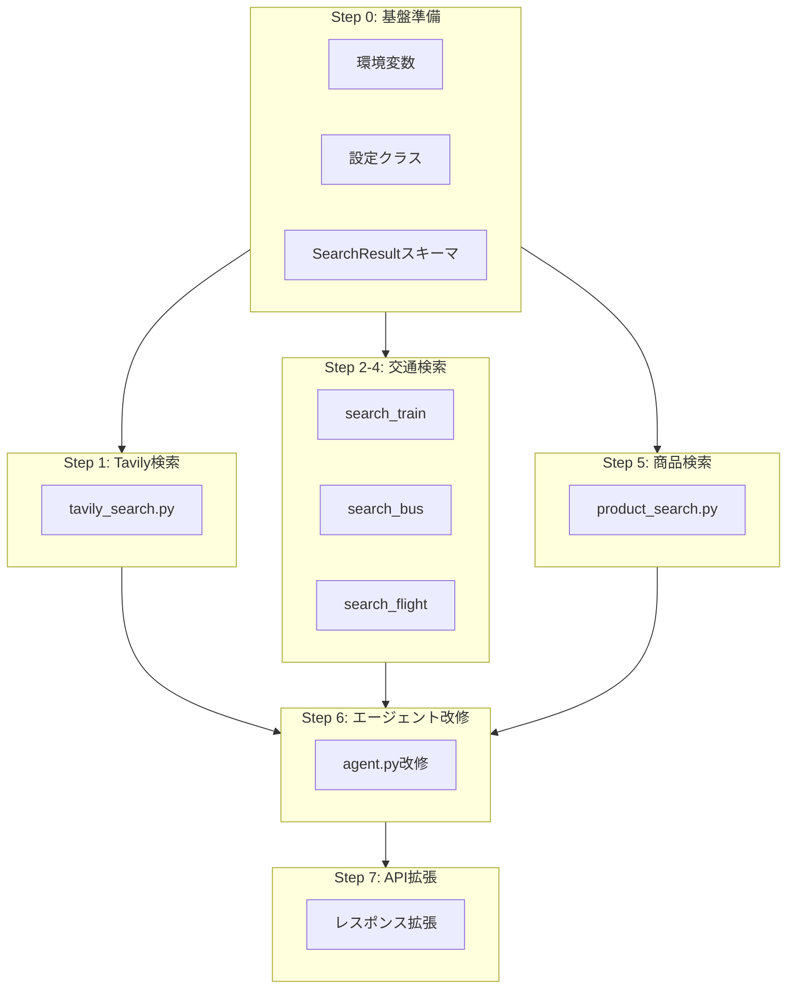

# Phase 3A Smart Proposal 実装計画

## 前提：実装の進め方

- 1つ実装 → 動作確認 → コミット のサイクルを繰り返す
- 依存関係のある機能は順番に、独立した機能は並行でもOK

---

## API一覧（変更・拡張）

Phase 3Aでは新規APIは追加せず、既存APIのレスポンスを拡張する：

| # | API | Method | 変更内容 | Status |
|---|-----|--------|---------|--------|
| 1 | `/api/v1/wish` | POST | `search_results` フィールドを追加 | ❌ Not implemented |

### レスポンス形式（拡張後）

```json
{
  "task_id": "uuid",
  "message": "Action proposed. Please confirm to execute, or request revisions.",
  "proposed_actions": ["17:00発 のぞみ47号を予約"],
  "proposal_detail": "【アクション】...",
  "search_results": [
    {
      "id": "train_001",
      "category": "train",
      "title": "のぞみ45号 16:00発",
      "url": "https://expy.jp/reserve/...",
      "price": 14500,
      "status": "available",
      "details": {
        "departure": "新大阪",
        "arrival": "博多",
        "date": "2024-12-28",
        "time": "16:00"
      },
      "execution_params": {
        "service": "ex_reservation",
        "requires_login": true
      }
    }
  ],
  "requires_confirmation": true
}
```

---

## 新規スキーマ

### SearchResult

```python
class SearchResultCategory(str, Enum):
    TRAIN = "train"
    BUS = "bus"
    FLIGHT = "flight"
    PRODUCT = "product"
    RESTAURANT = "restaurant"
    PROFESSIONAL = "professional"
    GENERAL = "general"

class SearchResult(BaseModel):
    id: str
    category: SearchResultCategory
    title: str
    url: Optional[str] = None
    price: Optional[int] = None
    status: Optional[str] = None  # "available", "limited", "sold_out"
    details: dict[str, Any] = {}
    execution_params: dict[str, Any] = {}
```

---

## 新規ツール

| # | ツール名 | ファイル | 機能 |
|---|---------|---------|------|
| 1 | `tavily_search` | `tavily_search.py` | 汎用Web検索（Tavily API） |
| 2 | `search_train` | `travel_search.py` | 電車・新幹線検索（Yahoo!乗換案内） |
| 3 | `search_bus` | `travel_search.py` | 高速バス検索（高速バスネット） |
| 4 | `search_flight` | `travel_search.py` | 航空機検索（スカイスキャナー） |
| 5 | `search_product` | `product_search.py` | 商品検索（価格.com/Amazon/楽天） |

---

## 実装ステップ

### Step 0: 基盤準備

| # | タスク | 説明 | Status |
|---|--------|------|--------|
| 0-1 | Tavily APIキー取得 | https://tavily.com でアカウント作成 | ❌ |
| 0-2 | 環境変数追加 | `.env` に `TAVILY_API_KEY` 追加 | ❌ |
| 0-3 | 設定クラス更新 | `app/config.py` に設定追加 | ❌ |
| 0-4 | SearchResultスキーマ追加 | `app/models/schemas.py` | ❌ |

### Step 1: Tavily検索ツール

| # | タスク | 説明 | Status |
|---|--------|------|--------|
| 1-1 | `tavily_search.py` 作成 | Tavily API連携 | ❌ |
| 1-2 | ツール登録 | `__init__.py` に追加 | ❌ |
| 1-3 | 単体テスト | `test_tavily_search.py` | ❌ |
| 1-4 | 動作確認 | 手動テスト | ❌ |

### Step 2: 交通検索ツール（電車・新幹線）

| # | タスク | 説明 | Status |
|---|--------|------|--------|
| 2-1 | `travel_search.py` 作成 | Yahoo!乗換案内スクレイピング | ❌ |
| 2-2 | `search_train` 実装 | 電車・新幹線検索 | ❌ |
| 2-3 | ツール登録 | `__init__.py` に追加 | ❌ |
| 2-4 | 単体テスト | `test_travel_search.py` | ❌ |
| 2-5 | 動作確認 | 手動テスト | ❌ |

### Step 3: 交通検索ツール（高速バス）

| # | タスク | 説明 | Status |
|---|--------|------|--------|
| 3-1 | `search_bus` 実装 | 高速バスネットスクレイピング | ❌ |
| 3-2 | 単体テスト追加 | `test_travel_search.py` | ❌ |
| 3-3 | 動作確認 | 手動テスト | ❌ |

### Step 4: 交通検索ツール（航空機）

| # | タスク | 説明 | Status |
|---|--------|------|--------|
| 4-1 | `search_flight` 実装 | スカイスキャナースクレイピング | ❌ |
| 4-2 | 単体テスト追加 | `test_travel_search.py` | ❌ |
| 4-3 | 動作確認 | 手動テスト | ❌ |

### Step 5: 商品検索ツール

| # | タスク | 説明 | Status |
|---|--------|------|--------|
| 5-1 | `product_search.py` 作成 | EC検索ツール | ❌ |
| 5-2 | `search_product_kakaku` 実装 | 価格.com検索 | ❌ |
| 5-3 | `search_product_amazon` 実装 | Amazon検索 | ❌ |
| 5-4 | `search_product_rakuten` 実装 | 楽天検索 | ❌ |
| 5-5 | ツール登録 | `__init__.py` に追加 | ❌ |
| 5-6 | 単体テスト | `test_product_search.py` | ❌ |
| 5-7 | 動作確認 | 手動テスト | ❌ |

### Step 6: エージェント改修

| # | タスク | 説明 | Status |
|---|--------|------|--------|
| 6-1 | 提案時ツール有効化 | `_propose_actions` でツール呼び出し | ❌ |
| 6-2 | 検索結果の構造化 | `search_results` を返す | ❌ |
| 6-3 | プロンプト改善 | 検索結果を使った提案 | ❌ |
| 6-4 | 統合テスト | エージェント経由のテスト | ❌ |

### Step 7: API拡張

| # | タスク | 説明 | Status |
|---|--------|------|--------|
| 7-1 | レスポンス形式更新 | `search_results` フィールド追加 | ❌ |
| 7-2 | エラーハンドリング | 検索失敗時のフォールバック | ❌ |
| 7-3 | 統合テスト | `test_api.py` 更新 | ❌ |
| 7-4 | 手動テスト | 全ユースケース確認 | ❌ |

---

## テストファイル構成

```
tests/
├── test_api.py                  # 既存（拡張）
├── test_chat_api.py             # 既存
├── test_tavily_search.py        # 新規: Tavily検索テスト
├── test_travel_search.py        # 新規: 交通検索テスト
└── test_product_search.py       # 新規: 商品検索テスト
```

---

## 手動テスト用コマンド

### Tavily検索

```powershell
# 汎用検索テスト
Invoke-RestMethod -Uri "http://localhost:8000/api/v1/wish" -Method POST -ContentType "application/json" -Body '{"wish": "税理士を探したい"}'
```

### 電車・新幹線検索

```powershell
# 新幹線検索テスト
Invoke-RestMethod -Uri "http://localhost:8000/api/v1/wish" -Method POST -ContentType "application/json" -Body '{"wish": "12月28日に新大阪から博多まで新幹線を予約したい"}'
```

### 商品検索

```powershell
# 商品検索テスト
Invoke-RestMethod -Uri "http://localhost:8000/api/v1/wish" -Method POST -ContentType "application/json" -Body '{"wish": "ノートPCを買いたい"}'
```

---

## 依存関係フロー



---

## 開始前チェックリスト

- [ ] Tavily APIキーを取得済み
- [ ] サーバーが起動できる状態
- [ ] 既存テストがパスする

---

## 次のアクション

Step 0から順番に実装を開始：

1. **Step 0-1**: Tavily APIキー取得
2. **Step 0-2**: 環境変数追加
3. **Step 0-3**: 設定クラス更新
4. **Step 0-4**: SearchResultスキーマ追加
