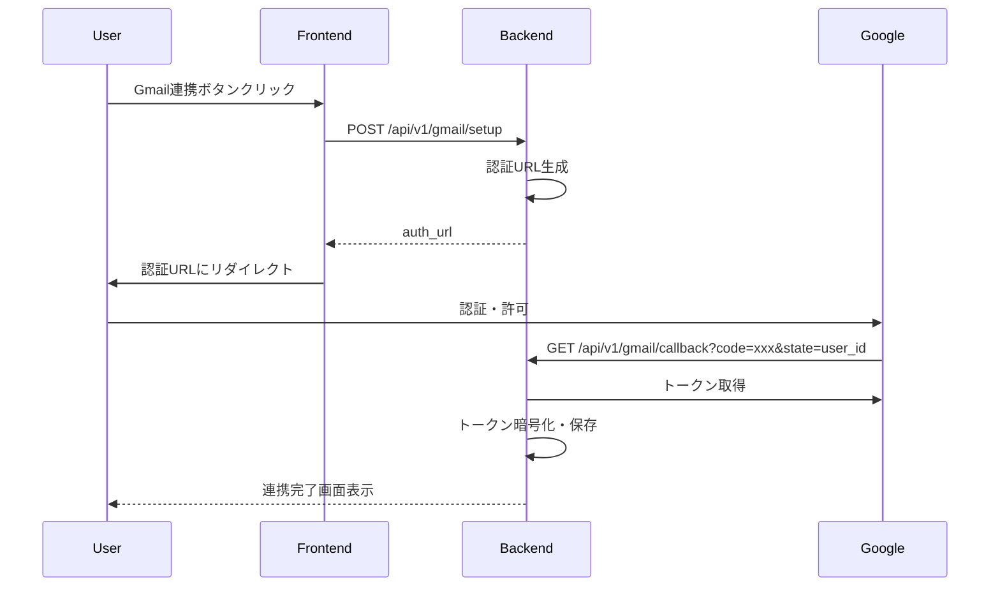

# Phase 5: Message Detection（メッセージ検知）

## 概要

メールとDoneチャットからのメッセージ受信を検知し、添付ファイルを取得・保存する機能を実装する。
Phase 6（Content Intelligence）でコンテンツ解析を行う前段階として、メッセージを統一的に管理する。

## Sub-phases

| Sub | 機能 | 説明 | 依存 |
|-----|------|------|------|
| 5A | Doneチャット検知 | WebSocket/DBトリガーで新着メッセージを検知 | Phase 2 (既存) |
| 5B | メール受信検知 | Gmail API連携で新着メール検知 | Gmail API設定 |
| 5C | 添付ファイル取得 | PDF/画像添付をダウンロード・保存 | 5B |

---

## 5A: Doneチャット検知

### 機能概要

Done Chatからの新着メッセージを検知し、`detected_messages`テーブルに保存する。

### 実装ファイル

- `app/services/message_detection.py` - MessageDetectionService

### 主要メソッド

```python
class MessageDetectionService:
    async def detect_message(
        user_id: str,
        source: MessageSource,
        content: str,
        source_id: Optional[str] = None,
        subject: Optional[str] = None,
        sender_info: Optional[dict] = None,
        metadata: Optional[dict] = None,
    ) -> dict
    
    async def get_detected_messages(
        user_id: str,
        source: Optional[MessageSource] = None,
        status: Optional[DetectionStatus] = None,
        content_type: Optional[ContentType] = None,
        limit: int = 50,
        offset: int = 0,
    ) -> List[dict]
    
    async def update_message_status(
        message_id: str,
        status: DetectionStatus,
        content_type: Optional[ContentType] = None,
        processing_result: Optional[dict] = None,
    ) -> Optional[dict]
    
    async def get_pending_messages(limit: int = 100) -> List[dict]
```

---

## 5B: メール受信検知（Gmail連携）

### 機能概要

Gmail APIを使用してユーザーのメールを取得し、`detected_messages`テーブルに保存する。
OAuth2認証によりユーザーの許可を得てメールアクセスを行う。

### 実装ファイル

- `app/services/gmail_service.py` - GmailService
- `app/api/gmail_routes.py` - Gmail API routes

### OAuth2フロー



### API エンドポイント

#### POST /api/v1/gmail/setup
Gmail OAuth2認証を開始

**Response:**
```json
{
  "auth_url": "https://accounts.google.com/o/oauth2/auth?...",
  "message": "Please visit this URL to authorize Gmail access"
}
```

#### GET /api/v1/gmail/callback
GoogleからのOAuth2コールバック（リダイレクト）

**Query Parameters:**
- `code`: Authorization code from Google
- `state`: User ID

**Response:** HTML表示（連携完了画面）

#### GET /api/v1/gmail/status
Gmail連携状態を確認

**Response:**
```json
{
  "connected": true,
  "email": "user@gmail.com",
  "last_sync": "2024-12-23T10:00:00+09:00",
  "is_active": true
}
```

#### POST /api/v1/gmail/sync
手動でメール同期を実行

**Query Parameters:**
- `max_results`: 最大取得件数（デフォルト: 50、最大: 100）

**Response:**
```json
{
  "success": true,
  "new_messages": 5,
  "message_ids": ["msg1", "msg2", "msg3", "msg4", "msg5"]
}
```

#### DELETE /api/v1/gmail/disconnect
Gmail連携を解除

**Response:**
```json
{
  "success": true,
  "message": "Gmail connection disconnected"
}
```

### 必要な環境変数

```env
GMAIL_CLIENT_ID=xxx.apps.googleusercontent.com
GMAIL_CLIENT_SECRET=xxx
GMAIL_REDIRECT_URI=http://localhost:8000/api/v1/gmail/callback
```

---

## 5C: 添付ファイル取得

### 機能概要

Gmailメッセージに添付されたPDF・画像ファイルをダウンロードし、ローカルストレージに保存する。

### 実装ファイル

- `app/services/attachment_service.py` - AttachmentService

### 対応MIMEタイプ

| MIMEタイプ | 拡張子 |
|-----------|--------|
| application/pdf | .pdf |
| image/png | .png |
| image/jpeg | .jpg |
| image/jpg | .jpg |
| image/gif | .gif |

### ファイルサイズ制限

- デフォルト: 10MB (`ATTACHMENT_MAX_SIZE_MB`環境変数で設定可能)

### ストレージ構成

```
data/attachments/
  └── {user_id}/
      └── {checksum_prefix}_{filename}.{ext}
```

### API エンドポイント

#### POST /api/v1/detection/messages/{message_id}/download-attachments
Gmailメッセージの添付ファイルをダウンロード・保存

**Response:**
```json
{
  "attachments": [
    {
      "id": "uuid-...",
      "detected_message_id": "uuid-...",
      "filename": "invoice.pdf",
      "mime_type": "application/pdf",
      "file_size": 123456,
      "storage_type": "local",
      "checksum": "sha256...",
      "created_at": "2024-12-23T10:00:00+09:00"
    }
  ]
}
```

#### GET /api/v1/detection/attachments/{attachment_id}
添付ファイルをダウンロード

**Response:** ファイルバイナリ（Content-Disposition: attachment）

#### GET /api/v1/detection/attachments/{attachment_id}/info
添付ファイル情報を取得

**Response:**
```json
{
  "id": "uuid-...",
  "filename": "invoice.pdf",
  "mime_type": "application/pdf",
  "file_size": 123456,
  "storage_type": "local",
  "checksum": "sha256...",
  "created_at": "2024-12-23T10:00:00+09:00"
}
```

#### DELETE /api/v1/detection/attachments/{attachment_id}
添付ファイルを削除

---

## 検知メッセージAPI

### GET /api/v1/detection/messages
検知メッセージ一覧を取得

**Query Parameters:**
- `source`: done_chat, gmail, line
- `status`: pending, processing, processed, failed
- `content_type`: invoice, otp, notification, general
- `limit`: 1-100（デフォルト: 50）
- `offset`: 0以上

**Response:**
```json
{
  "messages": [
    {
      "id": "uuid-...",
      "user_id": "uuid-...",
      "source": "gmail",
      "source_id": "gmail_msg_id",
      "content": "メール本文...",
      "subject": "請求書のお知らせ",
      "sender_info": {
        "from": "sender@example.com",
        "date": "2024-12-23"
      },
      "metadata": {
        "thread_id": "...",
        "label_ids": ["INBOX", "UNREAD"]
      },
      "status": "pending",
      "content_type": null,
      "created_at": "2024-12-23T10:00:00+09:00",
      "attachments": []
    }
  ],
  "total": 1
}
```

### GET /api/v1/detection/messages/{message_id}
検知メッセージを取得

---

## データモデル

### detected_messages テーブル

| カラム | 型 | 説明 |
|--------|-----|------|
| id | UUID | 主キー |
| user_id | UUID | ユーザーID（FK: users） |
| source | VARCHAR(20) | ソース: done_chat, gmail, line |
| source_id | VARCHAR(255) | 元のメッセージID |
| content | TEXT | メッセージ本文 |
| subject | VARCHAR(500) | 件名（メールの場合） |
| sender_info | JSONB | 送信者情報 |
| metadata | JSONB | ソース固有の追加情報 |
| status | VARCHAR(20) | pending, processing, processed, failed |
| content_type | VARCHAR(50) | invoice, otp, notification, general |
| processing_result | JSONB | 処理結果 |
| processed_at | TIMESTAMP | 処理完了日時 |
| created_at | TIMESTAMP | 作成日時 |

### gmail_connections テーブル

| カラム | 型 | 説明 |
|--------|-----|------|
| id | UUID | 主キー |
| user_id | UUID | ユーザーID（UNIQUE, FK: users） |
| email | VARCHAR(255) | Gmailアドレス |
| encrypted_token | TEXT | OAuth2トークン（暗号化済み） |
| last_history_id | VARCHAR(50) | Gmail履歴ID（差分取得用） |
| last_sync_at | TIMESTAMP | 最終同期日時 |
| is_active | BOOLEAN | アクティブフラグ |
| created_at | TIMESTAMP | 作成日時 |
| updated_at | TIMESTAMP | 更新日時 |

### message_attachments テーブル

| カラム | 型 | 説明 |
|--------|-----|------|
| id | UUID | 主キー |
| detected_message_id | UUID | 検知メッセージID（FK） |
| filename | VARCHAR(255) | ファイル名 |
| mime_type | VARCHAR(100) | MIMEタイプ |
| file_size | INTEGER | ファイルサイズ（バイト） |
| storage_path | TEXT | ストレージパス |
| storage_type | VARCHAR(20) | local, supabase |
| checksum | VARCHAR(64) | SHA256ハッシュ |
| extracted_text | TEXT | 抽出テキスト（Phase 6で使用） |
| created_at | TIMESTAMP | 作成日時 |

---

## Enum定義

### MessageSource
```python
class MessageSource(str, Enum):
    DONE_CHAT = "done_chat"
    GMAIL = "gmail"
    LINE = "line"
```

### DetectionStatus
```python
class DetectionStatus(str, Enum):
    PENDING = "pending"
    PROCESSING = "processing"
    PROCESSED = "processed"
    FAILED = "failed"
```

### ContentType
```python
class ContentType(str, Enum):
    INVOICE = "invoice"       # 請求書
    OTP = "otp"               # ワンタイムパスワード
    NOTIFICATION = "notification"  # 通知
    GENERAL = "general"       # 一般メッセージ
```

### StorageType
```python
class StorageType(str, Enum):
    LOCAL = "local"
    SUPABASE = "supabase"
```

---

## セキュリティ考慮事項

### 1. OAuth2トークンの暗号化
- Gmail OAuth2トークンは`encryption.py`で暗号化して保存
- Fernet暗号化（AES-128-CBC）を使用

### 2. Row Level Security
- 全テーブルでRLSを有効化
- ユーザーは自分のデータのみアクセス可能
- service_roleはフルアクセス

### 3. ファイルストレージ
- ユーザーごとにサブディレクトリを分離
- チェックサムによる重複検出
- ファイルサイズ制限

---

## テスト

### テストファイル
- `tests/test_phase5_message_detection.py`

### テストケース
1. メッセージ検知・保存
2. Gmail OAuth2フロー
3. メール同期
4. 添付ファイルダウンロード
5. 重複検出
6. ステータス更新

---

## 今後の拡張

1. **LINE連携** - LINE Messaging APIによるメッセージ検知（Phase 12）
2. **リアルタイム検知** - Gmail Pub/Sub Pushによるリアルタイム通知
3. **Supabase Storage** - 添付ファイルのクラウドストレージ対応

