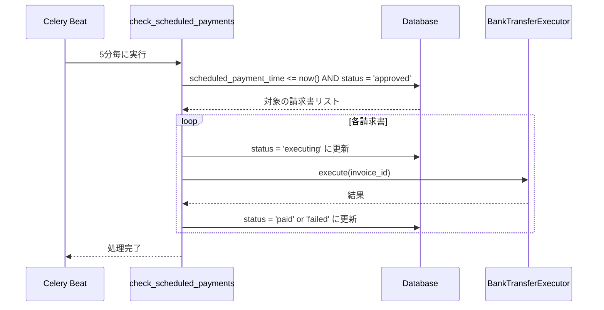
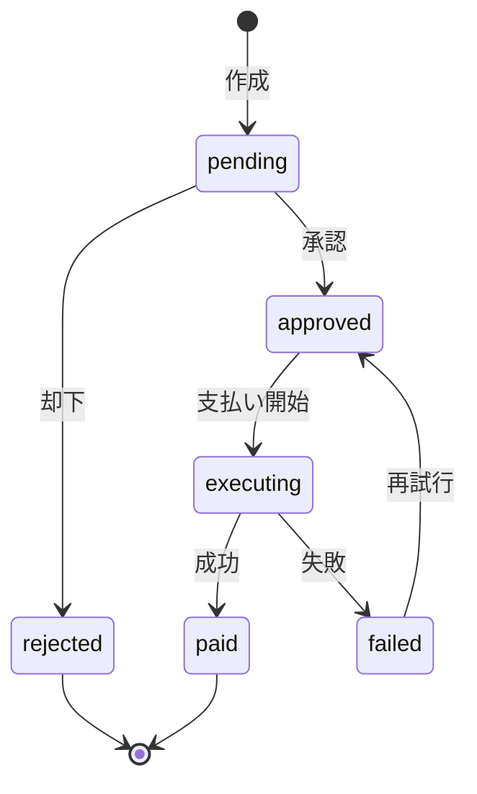

# Phase 7: Invoice Management（請求書管理）

## 概要

Phase 6（Content Intelligence）で請求書として分類されたコンテンツから詳細情報を抽出し、
支払いスケジュールを計算して管理する機能を実装する。
承認されたされた請求書はPhase 8（Payment Execution）で支払い実行される。

## Sub-phases

| Sub | 機能 | 説明 | 依存 |
|-----|------|------|------|
| 7A | 請求書情報抽出 | 金額、期日、振込先、発行元等をAIで抽出 | Phase 6 |
| 7B | スケジュール計算 | 期日前日18時 or 翌月末前日18時を計算 | 7A |
| 7C | 請求書保存・承認API | DB保存、承認/却下エンドポイント | 7B |
| 7D | スケジューラ | 指定時刻に支払いタスクをトリガー | 7C |

---

## 7A: 請求書情報抽出

### 機能概要

テキストから請求書の詳細情報をAI（Claude）で抽出する。

### 実装ファイル

- `app/services/invoice_service.py` - InvoiceExtractor

### 抽出項目

| 項目 | フィールド | 説明 |
|------|-----------|------|
| 金額 | amount | 税込み金額（整数、円単位） |
| 通貨 | currency | 通貨コード（デフォルト: JPY） |
| 支払期日 | due_date | YYYY-MM-DD形式 |
| 請求書番号 | invoice_number | 請求書番号 |
| 請求対象月 | invoice_month | YYYY-MM形式 |
| 発行元名 | issuer_name | 会社名・個人名 |
| 発行元住所 | issuer_address | 住所 |
| 振込先情報 | bank_info | 銀行名、支店、口座番号等 |
| 信頼度 | confidence_score | 0.0-1.0 |

### AIプロンプト

```
あなたは請求書解析AIです。
以下のテキストから請求書情報を抽出してください。

## 入力テキスト
{text}

## 出力形式（JSONのみ）
{
  "amount": 金額（整数、税込み、円単位）,
  "currency": "JPY",
  "due_date": "YYYY-MM-DD"形式の支払期日,
  "invoice_number": "請求書番号",
  "invoice_month": "YYYY-MM"形式の請求対象月,
  "issuer_name": "発行元の会社名・個人名",
  "issuer_address": "発行元の住所",
  "bank_info": {
    "bank_name": "銀行名",
    "branch_name": "支店名",
    "branch_code": "支店コード",
    "account_type": "普通 or 当座",
    "account_number": "口座番号",
    "account_holder": "口座名義（カタカナ）"
  },
  "confidence_score": 0.0-1.0の抽出信頼度
}
```

### 主要メソッド

```python
class InvoiceExtractor:
    @staticmethod
    async def extract_from_text(
        text: str,
        existing_data: Optional[Dict[str, Any]] = None,
    ) -> InvoiceExtractionResult
```

---

## 7B: スケジュール計算

### 機能概要

支払期日から支払い実行日時を計算する。

### 実装ファイル

- `app/services/invoice_service.py` - ScheduleCalculator

### 計算ロジック

1. **期日ベース**: 期日の**前日 18:00（JST）**に支払い実行
2. **翌月末ベース**: `invoice_month`が指定された場合、その翌月末の前日18:00

### 休日考慮（オプション）

- 土曜日 → 金曜日にシフト
- 日曜日 → 金曜日にシフト
- 祝日 → 前営業日にシフト（jpholidayライブラリ使用）

### 主要メソッド

```python
class ScheduleCalculator:
    JST = ZoneInfo("Asia/Tokyo")
    DEFAULT_PAYMENT_HOUR = 18
    
    @staticmethod
    def calculate_payment_schedule(
        due_date: datetime,
        invoice_month: Optional[str] = None,
        consider_holidays: bool = False,
    ) -> ScheduleCalculationResponse
    
    @staticmethod
    def calculate_from_invoice_month(
        invoice_month: str,  # "YYYY-MM"
        consider_holidays: bool = False,
    ) -> ScheduleCalculationResponse
    
    @staticmethod
    def is_payment_due(scheduled_time: datetime) -> bool
```

### レスポンス

```python
class ScheduleCalculationResponse(BaseModel):
    scheduled_payment_time: datetime  # 支払い実行予定日時
    due_date: datetime                # 元の期日
    days_until_payment: int           # 支払いまでの日数
    is_holiday_adjusted: bool         # 休日調整されたか
```

---

## 7C: 請求書保存・承認API

### 機能概要

請求書のCRUD操作と承認/却下ワークフローを提供する。

### 実装ファイル

- `app/services/invoice_service.py` - InvoiceService
- `app/api/invoice_routes.py` - Invoice API routes

### API エンドポイント

#### POST /api/v1/invoices
請求書を作成

**Request Body:**
```json
{
  "sender_name": "株式会社テスト",
  "amount": 50000,
  "due_date": "2024-01-31T00:00:00Z",
  "invoice_number": "INV-TEST-001",
  "invoice_month": "2024-01",
  "source": "manual",
  "source_channel": "manual",
  "bank_info": {
    "bank_name": "みずほ銀行",
    "branch_name": "本店",
    "account_type": "普通",
    "account_number": "1234567"
  }
}
```

**Response:**
```json
{
  "id": "uuid-...",
  "user_id": "uuid-...",
  "sender_name": "株式会社テスト",
  "amount": 50000,
  "due_date": "2024-01-31T00:00:00Z",
  "invoice_number": "INV-TEST-001",
  "status": "pending",
  "scheduled_payment_time": "2024-01-30T18:00:00+09:00",
  "is_duplicate": false,
  "created_at": "2024-12-23T10:00:00+09:00"
}
```

#### GET /api/v1/invoices
請求書一覧を取得

**Query Parameters:**
- `status`: pending, approved, paid, rejected, failed
- `page`: ページ番号（デフォルト: 1）
- `page_size`: 1ページあたりの件数（デフォルト: 20）

**Response:**
```json
{
  "invoices": [...],
  "total": 10,
  "page": 1,
  "page_size": 20
}
```

#### POST /api/v1/invoices/{invoice_id}/approve
請求書を承認

**Request Body:**
```json
{
  "payment_type": "bank_transfer",
  "payment_method_id": "uuid-...",
  "scheduled_time_override": "2024-01-29T18:00:00+09:00"
}
```

**Response:**
```json
{
  "id": "uuid-...",
  "status": "approved",
  "approved_at": "2024-12-23T10:00:00+09:00",
  "approved_by": "user-uuid-...",
  ...
}
```

#### POST /api/v1/invoices/{invoice_id}/reject
請求書を却下

**Request Body:**
```json
{
  "reason": "金額が違う"
}
```

**Response:**
```json
{
  "id": "uuid-...",
  "status": "rejected",
  "error_message": "Rejected: 金額が違う",
  ...
}
```

---

## 7D: 支払いスケジューラ

### 機能概要

Celery Beatを使用して定期的に支払い時刻が到来した請求書をチェックし、
Phase 8の振込Executorを起動する。

### 実装ファイル

- `app/tasks/payment_tasks.py` - check_scheduled_payments
- `app/tasks/celery_app.py` - Celery Beat設定

### スケジュール設定

```python
celery_app.conf.beat_schedule.update({
    'check-scheduled-payments': {
        'task': 'app.tasks.payment_tasks.check_scheduled_payments',
        'schedule': crontab(minute='*/5'),  # 5分毎
    },
})
```

### 処理フロー



### Celeryタスク

```python
@shared_task(name="app.tasks.payment_tasks.check_scheduled_payments")
def check_scheduled_payments():
    """
    スケジュールされた支払いをチェックして実行
    
    Returns:
        {
            "processed": 処理件数,
            "success": 成功件数,
            "failed": 失敗件数,
            "checked_at": チェック日時
        }
    """

@shared_task(name="app.tasks.payment_tasks.execute_single_payment")
def execute_single_payment(invoice_id: str, user_id: str, bank_type: str = "simulation"):
    """
    単一の支払いを実行
    """
```

---

## データモデル

### invoices テーブル

| カラム | 型 | 説明 |
|--------|-----|------|
| id | UUID | 主キー |
| user_id | UUID | ユーザーID |
| sender_name | VARCHAR(255) | 発行元名 |
| sender_contact_type | VARCHAR(50) | 連絡先タイプ |
| sender_contact_id | VARCHAR(255) | 連絡先ID |
| amount | INTEGER | 金額（税込み、円） |
| due_date | TIMESTAMP | 支払期日 |
| invoice_number | VARCHAR(100) | 請求書番号 |
| invoice_month | VARCHAR(7) | 請求対象月（YYYY-MM） |
| source | VARCHAR(20) | ソース: email, chat, manual |
| source_channel | VARCHAR(50) | ソースチャンネル |
| source_url | TEXT | ソースURL |
| bank_info | JSONB | 振込先情報 |
| raw_content | TEXT | 元のコンテンツ |
| pdf_data | TEXT | PDFデータ（Base64） |
| screenshot | TEXT | スクリーンショット（Base64） |
| status | VARCHAR(20) | ステータス |
| duplicate_check_hash | VARCHAR(32) | 重複チェック用ハッシュ |
| scheduled_payment_time | TIMESTAMP | 支払い予定日時 |
| approved_at | TIMESTAMP | 承認日時 |
| approved_by | UUID | 承認者ID |
| selected_payment_type | VARCHAR(20) | 支払い方法タイプ |
| selected_payment_method_id | UUID | 支払い方法ID |
| paid_at | TIMESTAMP | 支払い完了日時 |
| transaction_id | VARCHAR(100) | 取引ID |
| execution_log_id | UUID | 実行ログID |
| error_message | TEXT | エラーメッセージ |
| created_at | TIMESTAMP | 作成日時 |
| updated_at | TIMESTAMP | 更新日時 |

---

## Enum定義

### InvoiceStatus
```python
class InvoiceStatus(str, Enum):
    PENDING = "pending"           # 承認待ち
    APPROVED = "approved"         # 承認済み
    SCHEDULED = "scheduled"       # 支払いスケジュール済み
    EXECUTING = "executing"       # 支払い実行中
    PAID = "paid"                 # 支払い完了
    REJECTED = "rejected"         # 却下
    FAILED = "failed"             # 支払い失敗
```

### InvoiceSource
```python
class InvoiceSource(str, Enum):
    EMAIL = "email"               # メールから検出
    CHAT = "chat"                 # チャットから検出
    MANUAL = "manual"             # 手動入力
```

### PaymentType
```python
class PaymentType(str, Enum):
    BANK_TRANSFER = "bank_transfer"   # 銀行振込
    CREDIT_CARD = "credit_card"       # クレジットカード
    CONVENIENCE = "convenience"       # コンビニ払い
    AUTO_DEBIT = "auto_debit"         # 口座振替
```

---

## 重複チェック

### ハッシュ生成

```python
def _generate_duplicate_hash(sender_name: str, amount: int, due_date: datetime) -> str:
    hash_input = f"{sender_name}|{amount}|{due_date.strftime('%Y-%m-%d')}"
    return hashlib.sha256(hash_input.encode()).hexdigest()[:32]
```

### チェック条件

- 同じハッシュ値を持つ請求書が過去30日以内に存在する場合、重複と判定
- 重複の場合は`is_duplicate=True`、`duplicate_of=既存ID`を返す

---

## ステータス遷移



---

## テスト

### テストファイル
- `tests/test_invoice_management.py`

### テストケース

#### InvoiceExtractor
1. Phase 6の抽出データをパース
2. 文字列金額をパース
3. 日本語日付形式をパース
4. bank_infoがnull/部分的な場合の処理
5. AI呼び出しによる抽出

#### ScheduleCalculator
1. 基本的なスケジュール計算（期日の前日18:00）
2. 2月末の期日テスト
3. 請求対象月からの計算（翌月末の前日）
4. 土日の調整
5. 支払い時刻到来チェック

#### Invoice API
1. 請求書作成（最小/フル）
2. 請求書一覧取得
3. ステータスフィルタ
4. ページネーション
5. 承認/却下
6. 却下済みの承認不可
7. 認証チェック

---

## セキュリティ考慮事項

### 1. 認証必須
- 全てのAPIエンドポイントで認証が必要
- `get_current_user`依存関係で認証チェック

### 2. Row Level Security
- ユーザーは自分の請求書のみアクセス可能

### 3. 重複チェック
- 同じ請求書の二重登録を防止

### 4. 金額検証
- 金額は0より大きい整数のみ受け付け

---

## 今後の拡張

1. **請求書PDF生成** - 請求書情報からPDFを生成
2. **自動分類・自動承認** - ルールベースの自動処理
3. **通知機能** - 支払い期日リマインダー
4. **会計ソフト連携** - freee、マネーフォワード等との連携

