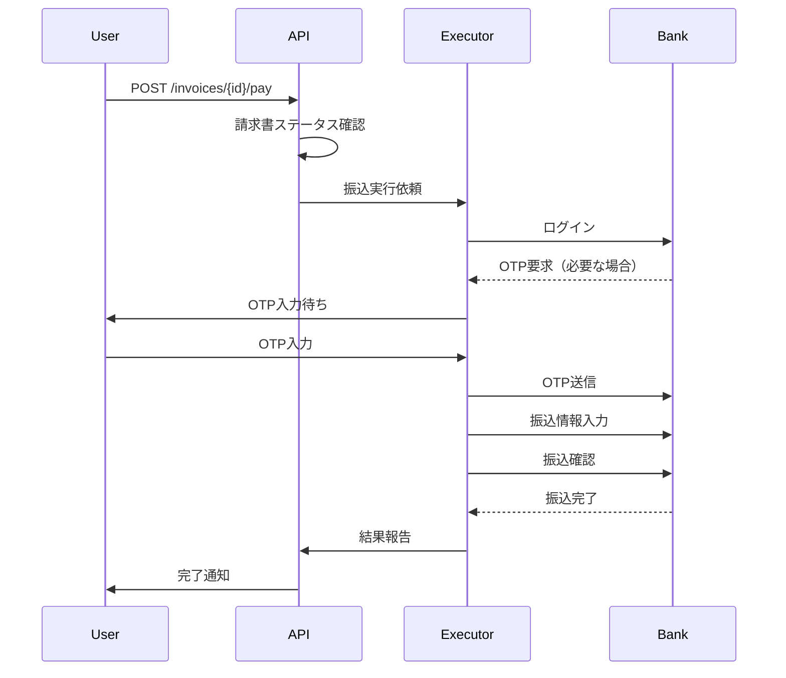

# Phase 8: Payment Execution（支払い実行）

## 概要

Phase 7で管理される請求書に対して、実際に銀行振込を実行する機能を実装する。
ネットバンキングの自動操作にはPlaywrightを使用し、既存のExecutorパターンに従う。

## Sub-phases

| Sub | 機能 | 説明 | 依存 |
|-----|------|------|------|
| 8A | 銀行振込Executor | ネットバンキングをPlaywrightで自動操作 | Phase 7, Phase 3B |
| 8B | 振込先管理 | 振込先情報の保存・検証 | なし |

---

## 8B: 振込先管理

### 機能概要

よく使う振込先情報を保存・管理する機能。
請求書の振込先情報を「お気に入り」として登録し、次回からの入力を省略できる。

### データモデル

```sql
-- saved_bank_accounts: 保存済み振込先
CREATE TABLE IF NOT EXISTS saved_bank_accounts (
    id UUID PRIMARY KEY DEFAULT uuid_generate_v4(),
    user_id UUID NOT NULL,
    display_name VARCHAR(100) NOT NULL,           -- 表示名（例：「○○株式会社」）
    bank_name VARCHAR(100) NOT NULL,              -- 銀行名
    bank_code VARCHAR(4),                         -- 銀行コード
    branch_name VARCHAR(100) NOT NULL,            -- 支店名
    branch_code VARCHAR(3),                       -- 支店コード
    account_type VARCHAR(10) NOT NULL,            -- 普通/当座
    account_number VARCHAR(7) NOT NULL,           -- 口座番号
    account_holder VARCHAR(100) NOT NULL,         -- 口座名義（カタカナ）
    is_verified BOOLEAN DEFAULT FALSE,            -- 検証済みフラグ
    last_used_at TIMESTAMP WITH TIME ZONE,        -- 最終使用日時
    created_at TIMESTAMP WITH TIME ZONE DEFAULT NOW(),
    updated_at TIMESTAMP WITH TIME ZONE DEFAULT NOW()
);

-- Index
CREATE INDEX idx_saved_bank_accounts_user_id ON saved_bank_accounts(user_id);
CREATE UNIQUE INDEX idx_saved_bank_accounts_unique 
    ON saved_bank_accounts(user_id, bank_code, branch_code, account_number);
```

### API エンドポイント

#### POST /api/v1/bank-accounts
振込先を保存

**Request Body:**
```json
{
  "display_name": "株式会社サンプル",
  "bank_name": "三菱UFJ銀行",
  "bank_code": "0005",
  "branch_name": "渋谷支店",
  "branch_code": "045",
  "account_type": "普通",
  "account_number": "1234567",
  "account_holder": "カ）サンプル"
}
```

**Response:**
```json
{
  "id": "uuid-...",
  "display_name": "株式会社サンプル",
  "bank_name": "三菱UFJ銀行",
  "bank_code": "0005",
  "branch_name": "渋谷支店",
  "branch_code": "045",
  "account_type": "普通",
  "account_number": "1234567",
  "account_holder": "カ）サンプル",
  "is_verified": false,
  "created_at": "2024-12-23T10:00:00+09:00"
}
```

#### GET /api/v1/bank-accounts
保存済み振込先一覧を取得

**Response:**
```json
{
  "bank_accounts": [
    {
      "id": "uuid-...",
      "display_name": "株式会社サンプル",
      "bank_name": "三菱UFJ銀行",
      "branch_name": "渋谷支店",
      "account_type": "普通",
      "account_number": "****567",
      "account_holder": "カ）サンプル",
      "is_verified": true,
      "last_used_at": "2024-12-20T18:00:00+09:00"
    }
  ],
  "total": 1
}
```

#### GET /api/v1/bank-accounts/{id}
振込先詳細を取得

#### DELETE /api/v1/bank-accounts/{id}
振込先を削除

---

## 8A: 銀行振込Executor

### 機能概要

承認済み請求書に対して、ネットバンキングを自動操作して振込を実行する。
初期実装では以下の銀行をサポート：

1. **シミュレーションモード**（開発・テスト用）
2. **住信SBIネット銀行**（実装例）

### 実行フロー



### API エンドポイント

#### POST /api/v1/invoices/{id}/pay
請求書の支払いを実行

**Request Body:**
```json
{
  "payment_method_id": "uuid-...",  // 保存済み支払い元口座ID（オプション）
  "use_saved_recipient": true,      // 保存済み振込先を使用
  "saved_recipient_id": "uuid-..."  // 保存済み振込先ID
}
```

**Response:**
```json
{
  "invoice_id": "uuid-...",
  "status": "executing",
  "execution_id": "uuid-...",
  "message": "振込処理を開始しました"
}
```

#### GET /api/v1/invoices/{id}/payment-status
支払い実行状況を取得

**Response:**
```json
{
  "invoice_id": "uuid-...",
  "status": "executing",
  "current_step": "entering_amount",
  "steps_completed": ["logged_in", "opened_transfer_page"],
  "steps_remaining": ["confirming", "completed"],
  "requires_otp": false,
  "error": null
}
```

### Executor実装

```python
# app/executors/bank_transfer_executor.py

class BankTransferExecutor(BaseExecutor):
    """銀行振込Executor"""
    
    service_name = "bank_transfer"
    
    required_steps = [
        "opened_url",
        "logged_in",
        "opened_transfer_page",
        "entering_recipient",
        "entering_amount",
        "confirming",
        "completed"
    ]
    
    async def _do_execute(
        self,
        task_id: str,
        invoice: dict,
        credentials: Optional[dict] = None,
        bank_type: str = "simulation"
    ) -> ExecutionResult:
        """振込実行"""
        # 銀行タイプに応じたハンドラを選択
        handler = self._get_bank_handler(bank_type)
        return await handler.execute_transfer(
            invoice=invoice,
            credentials=credentials,
            progress_callback=lambda step: self._update_progress(task_id, step)
        )
```

### 銀行別ハンドラ

```python
# app/executors/banks/simulation_bank.py
class SimulationBankHandler:
    """シミュレーション用ハンドラ（テスト・開発用）"""
    
    async def execute_transfer(self, invoice, credentials, progress_callback):
        # 各ステップをシミュレーション
        await progress_callback("opened_url")
        await asyncio.sleep(1)
        await progress_callback("logged_in")
        # ... 以下略
        
        return ExecutionResult(
            success=True,
            transaction_id=f"SIM-{datetime.now().strftime('%Y%m%d%H%M%S')}",
            message="シミュレーション振込完了"
        )
```

---

## セキュリティ考慮事項

### 1. 認証情報の保護
- ネットバンキングの認証情報は既存の`credentials_service`で暗号化保存
- OTPは一時的にメモリ上でのみ処理、ログには記録しない

### 2. 振込金額の検証
- 請求書の金額と振込金額が一致することを確認
- 高額振込（設定可能、デフォルト10万円以上）は追加確認を要求

### 3. 監査ログ
- すべての振込操作を`execution_logs`テーブルに記録
- 金額・振込先・実行日時を完全に記録

### 4. 振込先の検証
- 初回振込時は振込先情報を手動確認
- 検証済みフラグで管理

---

## 7D: 支払いスケジューラ（Celery Beat連携）

Phase 7のスケジュール計算結果に基づき、支払い時刻が到来したらPhase 8の振込Executorを起動する。

### スケジュール設定

```python
# app/tasks/celery_app.py に追加
celery_app.conf.beat_schedule.update({
    'check-scheduled-payments': {
        'task': 'app.tasks.payment_tasks.check_scheduled_payments',
        'schedule': crontab(minute='*/5'),  # 5分毎
    },
})
```

### 処理フロー

1. Celery Beatが5分毎に`check_scheduled_payments`を実行
2. `scheduled_payment_time <= now()`かつ`status = 'approved'`の請求書を検索
3. 各請求書に対して振込タスクをキューに追加
4. 振込完了後、`status`を`paid`に更新

---

## テスト計画

### ユニットテスト
- `tests/test_bank_account_api.py`: 振込先CRUD
- `tests/test_bank_transfer_executor.py`: Executor（シミュレーション）

### 統合テスト
- 請求書作成 → 承認 → 支払い実行の一連フロー
- シミュレーションモードで全ステップを確認

### 手動テスト
- 実際のネットバンキングでのテストは慎重に（少額で検証）

---

## 実装順序

1. **8B: 振込先管理**
   - DBマイグレーション
   - POST /api/v1/bank-accounts → 動作確認 → コミット
   - GET /api/v1/bank-accounts → 動作確認 → コミット
   - DELETE /api/v1/bank-accounts/{id} → 動作確認 → コミット

2. **8A: 銀行振込Executor**
   - BankTransferExecutor基盤
   - SimulationBankHandler
   - POST /api/v1/invoices/{id}/pay → 動作確認 → コミット

3. **7D: 支払いスケジューラ**
   - check_scheduled_payments タスク
   - Celery Beat設定 → 動作確認 → コミット

---

## 備考

- 実際の銀行サイトの自動操作は利用規約に抵触する可能性があるため、本番運用前に法的確認が必要
- まずはシミュレーションモードで全体のフローを完成させる
- 銀行API（Open Banking）が利用可能な場合はそちらを優先検討

