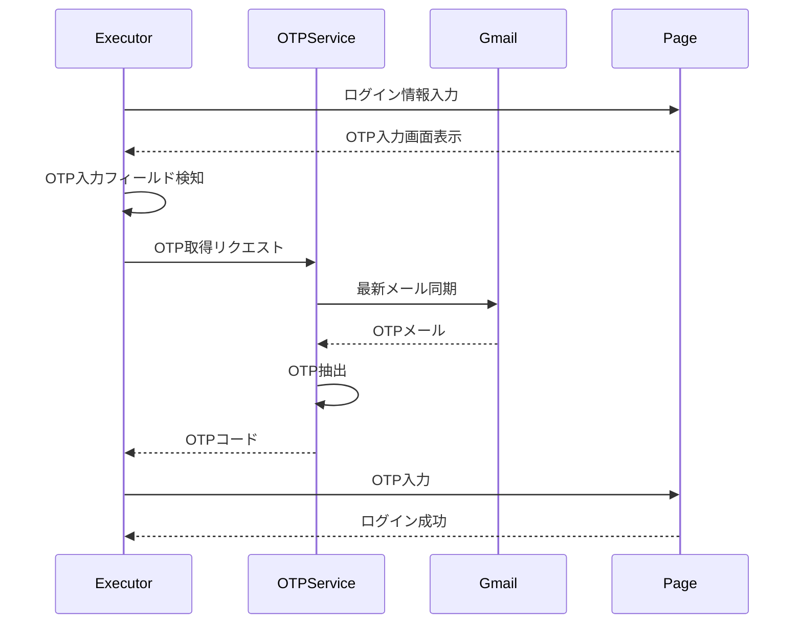

# Phase 9: OTP Automation（OTP自動化）

## 概要

メール・SMSからワンタイムパスワード（OTP）を自動取得し、既存のExecutorによるログイン処理に統合する機能を実装する。
これにより、二段階認証が必要なサービスでも自動ログインが可能になる。

## Sub-phases

| Sub | 機能 | 説明 | 依存 |
|-----|------|------|------|
| 9A | メールOTP取得 | メールからワンタイムパスワードを抽出 | Phase 5B (Gmail連携) |
| 9B | SMS OTP取得 | SMSからワンタイムパスワードを取得 | Twilio API |
| 9C | 音声OTP取得 | 電話認証の音声からOTPを取得 | Phase 10A (未実装のため今回スキップ) |
| 9D | Executor統合 | 既存Executorのログイン処理にOTP自動入力を組み込み | 9A, 9B |

---

## 9A: メールOTP取得

### 機能概要

Gmail（Phase 5B）で受信したメールから、OTP（ワンタイムパスワード）を自動抽出する。
ログイン操作中にExecutorがOTPを要求した際、最新のメールからOTPを取得して返す。

### OTP抽出ロジック

1. **送信元フィルタリング** - OTPを送信するサービスのドメインを特定
2. **件名マッチング** - 「認証コード」「確認コード」「ワンタイムパスワード」等のキーワード
3. **正規表現抽出** - 本文から4〜8桁の数字を抽出
4. **時間制限** - 過去5分以内のメールのみ対象

### OTPパターン定義

```python
OTP_PATTERNS = [
    r'(?:認証コード|確認コード|ワンタイムパスワード|OTP|verification code|passcode)[：:\s]*(\d{4,8})',
    r'(?:コード|code)[：:\s]*(\d{4,8})',
    r'\b(\d{6})\b',  # 6桁の数字（最も一般的）
]

# 送信元ドメインのホワイトリスト（サービス別）
OTP_SENDER_DOMAINS = {
    "amazon": ["amazon.co.jp", "amazon.com"],
    "ex_reservation": ["expy.jp", "jr-central.co.jp"],
    "rakuten": ["rakuten.co.jp"],
    "line": ["line.me"],
    "google": ["google.com"],
}
```

### データモデル

```sql
-- otp_extractions: OTP抽出履歴
CREATE TABLE IF NOT EXISTS otp_extractions (
    id UUID PRIMARY KEY DEFAULT uuid_generate_v4(),
    user_id UUID NOT NULL,
    source VARCHAR(20) NOT NULL,            -- email, sms
    source_id VARCHAR(255),                 -- メールID or SMS ID
    service VARCHAR(50),                    -- amazon, ex_reservation等
    sender VARCHAR(255),                    -- 送信元
    otp_code VARCHAR(20) NOT NULL,          -- 抽出されたOTP
    extracted_at TIMESTAMP WITH TIME ZONE DEFAULT NOW(),
    used_at TIMESTAMP WITH TIME ZONE,       -- 使用日時
    expires_at TIMESTAMP WITH TIME ZONE,    -- 有効期限
    is_used BOOLEAN DEFAULT FALSE,
    created_at TIMESTAMP WITH TIME ZONE DEFAULT NOW()
);

-- Index
CREATE INDEX idx_otp_extractions_user_service ON otp_extractions(user_id, service);
CREATE INDEX idx_otp_extractions_expires ON otp_extractions(expires_at);
```

### API エンドポイント

#### POST /api/v1/otp/extract/email
メールからOTPを抽出

**Request Body:**
```json
{
  "service": "amazon",           // 対象サービス（オプション）
  "max_age_minutes": 5,          // 最大経過時間（デフォルト: 5分）
  "sender_filter": "amazon.co.jp"  // 送信元フィルタ（オプション）
}
```

**Response:**
```json
{
  "success": true,
  "otp": {
    "id": "uuid-...",
    "code": "123456",
    "source": "email",
    "sender": "noreply@amazon.co.jp",
    "subject": "Amazonサインイン認証コード",
    "extracted_at": "2024-12-23T10:00:00+09:00",
    "expires_at": "2024-12-23T10:10:00+09:00"
  }
}
```

#### GET /api/v1/otp/latest
最新のOTPを取得

**Query Parameters:**
- `service`: 対象サービス（オプション）
- `source`: email, sms（オプション）

**Response:**
```json
{
  "otp": {
    "id": "uuid-...",
    "code": "123456",
    "source": "email",
    "service": "amazon",
    "is_used": false,
    "extracted_at": "2024-12-23T10:00:00+09:00"
  }
}
```

#### POST /api/v1/otp/{id}/mark-used
OTPを使用済みにマーク

**Response:**
```json
{
  "success": true,
  "message": "OTP marked as used"
}
```

#### GET /api/v1/otp/history
OTP抽出履歴を取得

**Query Parameters:**
- `limit`: 取得件数（デフォルト: 20）
- `service`: サービスでフィルタ

---

## 9B: SMS OTP取得

### 機能概要

Twilio経由でSMSを受信し、OTPを抽出する。
ユーザーがTwilioの電話番号を設定することで、SMSベースの二段階認証に対応。

### Twilio設定

```env
TWILIO_ACCOUNT_SID=ACxxx
TWILIO_AUTH_TOKEN=xxx
TWILIO_PHONE_NUMBER=+81xxxxxxxxxx
```

### Webhook設定

TwilioのSMS受信Webhookを設定：

```
https://your-domain.com/api/v1/otp/sms/webhook
```

### API エンドポイント

#### GET /api/v1/otp/sms/status
SMS受信設定状態を確認

**Response:**
```json
{
  "configured": true,
  "phone_number": "+81xxxxxxxxxx",
  "webhook_url": "https://your-domain.com/api/v1/otp/sms/webhook"
}
```

#### POST /api/v1/otp/sms/webhook
Twilio SMS受信Webhook（Twilioから呼び出される）

**Request Body (Twilio形式):**
```
From=+81xxxxxxxxxx&To=+81xxxxxxxxxx&Body=Your verification code is 123456
```

**Response:** TwiML (空レスポンス)

#### POST /api/v1/otp/extract/sms
受信SMSからOTPを抽出

**Request Body:**
```json
{
  "service": "amazon",
  "max_age_minutes": 5
}
```

**Response:** 9AのPOST /api/v1/otp/extract/emailと同形式

---

## 9D: Executor統合

### 機能概要

既存のExecutor（Amazon、EX予約等）のログインフローにOTP自動入力機能を統合する。
Executorがログイン中にOTP入力を検知した場合、自動的にOTPを取得して入力する。

### OTP待機・取得フロー



### OTPServiceクラス

```python
# app/services/otp_service.py

class OTPService:
    """OTP抽出・管理サービス"""
    
    async def extract_otp_from_email(
        self,
        user_id: str,
        service: Optional[str] = None,
        max_age_minutes: int = 5,
        sender_filter: Optional[str] = None,
    ) -> Optional[OTPResult]:
        """メールからOTPを抽出"""
        pass
    
    async def extract_otp_from_sms(
        self,
        user_id: str,
        service: Optional[str] = None,
        max_age_minutes: int = 5,
    ) -> Optional[OTPResult]:
        """SMSからOTPを抽出"""
        pass
    
    async def wait_for_otp(
        self,
        user_id: str,
        service: str,
        source: str = "email",  # email or sms
        timeout_seconds: int = 60,
        poll_interval: int = 5,
    ) -> Optional[str]:
        """
        OTPが届くまで待機して取得
        Executorから呼び出される
        """
        pass
    
    async def mark_otp_used(self, otp_id: str) -> bool:
        """OTPを使用済みにマーク"""
        pass
```

### BaseExecutor拡張

```python
# app/executors/base.py に追加

class BaseExecutor:
    
    async def _handle_otp_challenge(
        self,
        page,
        task_id: str,
        user_id: str,
        service: str,
    ) -> Optional[str]:
        """
        OTP入力が必要な場合の処理
        
        1. OTP入力フィールドを検知
        2. OTPServiceからコードを取得
        3. フィールドに入力
        """
        from app.services.otp_service import get_otp_service
        otp_service = get_otp_service()
        
        # OTP待機（最大60秒）
        otp_code = await otp_service.wait_for_otp(
            user_id=user_id,
            service=service,
            timeout_seconds=60,
        )
        
        if otp_code:
            await self._update_progress(
                task_id=task_id,
                step="otp_received",
                details={"source": "email"},
            )
            return otp_code
        
        return None
```

### OTP検知パターン（Playwright）

```python
# OTP入力フィールドの検知セレクタ
OTP_FIELD_SELECTORS = [
    'input[name*="otp"]',
    'input[name*="code"]',
    'input[name*="verification"]',
    'input[placeholder*="認証コード"]',
    'input[placeholder*="確認コード"]',
    'input[aria-label*="認証コード"]',
    '#otp',
    '#verificationCode',
]

# OTP入力画面の検知パターン
OTP_PAGE_INDICATORS = [
    "認証コード",
    "確認コード", 
    "ワンタイムパスワード",
    "Enter OTP",
    "Enter verification code",
    "Two-factor authentication",
]
```

---

## Enum定義

### OTPSource
```python
class OTPSource(str, Enum):
    EMAIL = "email"
    SMS = "sms"
    VOICE = "voice"  # Phase 10で実装
```

### OTPStatus
```python
class OTPStatus(str, Enum):
    PENDING = "pending"     # 抽出待ち
    EXTRACTED = "extracted" # 抽出済み
    USED = "used"           # 使用済み
    EXPIRED = "expired"     # 期限切れ
```

---

## セキュリティ考慮事項

### 1. OTPの保存ポリシー
- OTPコードは暗号化して保存
- 使用済みOTPは24時間後に自動削除
- 有効期限切れOTPは即座に無効化

### 2. アクセス制御
- ユーザーは自分のOTPのみ取得可能
- OTP抽出履歴はユーザー別に分離
- RLSで厳格にアクセス制御

### 3. 悪用防止
- 短時間での大量OTPリクエストを制限（レートリミット）
- 同一OTPの複数回使用を禁止
- 不審なパターンを検知してアラート

---

## テスト計画

### ユニットテスト
- `tests/test_otp_extraction.py`: OTP抽出ロジック
- `tests/test_otp_api.py`: OTP API

### テストケース

| # | テスト内容 | 期待結果 |
|---|----------|---------|
| 1 | メール本文からOTPを抽出 | 正しい6桁コードを返す |
| 2 | 複数パターンのOTPを抽出 | 各パターンで正しく抽出 |
| 3 | 古いメールを除外 | max_age_minutes以内のみ返す |
| 4 | 送信元フィルタリング | 指定ドメインのみ対象 |
| 5 | OTPを使用済みにマーク | is_used=trueに更新 |
| 6 | 最新OTP取得API | 最新の未使用OTPを返す |
| 7 | SMS受信Webhook | OTPを正しく保存 |
| 8 | OTP待機タイムアウト | タイムアウト時にNone |

---

## 実装順序

### Phase 9A: メールOTP取得
1. DBマイグレーション（otp_extractionsテーブル） → 動作確認 → コミット
2. OTPServiceの基本実装 → ユニットテスト → コミット
3. POST /api/v1/otp/extract/email → 手動テスト → 自動テスト → README更新 → コミット
4. GET /api/v1/otp/latest → 手動テスト → 自動テスト → README更新 → コミット
5. POST /api/v1/otp/{id}/mark-used → 手動テスト → 自動テスト → README更新 → コミット
6. GET /api/v1/otp/history → 手動テスト → 自動テスト → README更新 → コミット

### Phase 9B: SMS OTP取得
1. Twilio設定・環境変数 → ドキュメント更新 → コミット
2. GET /api/v1/otp/sms/status → 手動テスト → コミット
3. POST /api/v1/otp/sms/webhook → Twilioとの連携テスト → コミット
4. POST /api/v1/otp/extract/sms → 手動テスト → 自動テスト → README更新 → コミット

### Phase 9D: Executor統合
1. BaseExecutor._handle_otp_challenge実装 → コミット
2. wait_for_otp実装（ポーリング） → コミット
3. AmazonExecutorにOTP統合 → E2Eテスト → コミット
4. EXReservationExecutorにOTP統合 → E2Eテスト → コミット

---

## 必要な環境変数

```env
# Twilio (9B)
TWILIO_ACCOUNT_SID=ACxxx
TWILIO_AUTH_TOKEN=xxx
TWILIO_PHONE_NUMBER=+81xxxxxxxxxx

# OTP設定
OTP_DEFAULT_EXPIRY_MINUTES=10
OTP_MAX_AGE_MINUTES=5
OTP_POLL_INTERVAL_SECONDS=5
OTP_WAIT_TIMEOUT_SECONDS=60
```

---

## 今後の拡張

1. **Phase 9C: 音声OTP** - Phase 10完了後に電話認証の音声からOTPを取得
2. **TOTP対応** - Google Authenticator等のTOTPアプリからのコード取得
3. **Push通知OTP** - モバイルアプリのPush通知認証に対応


