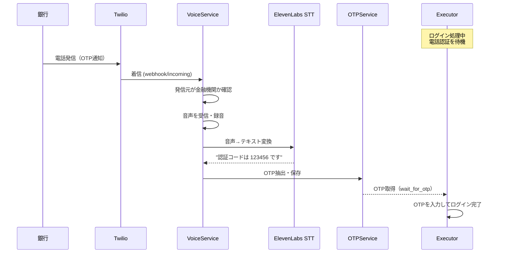

# Phase 9C: 音声OTP抽出

## 概要

電話認証（コールバック認証）で通知されるOTP（ワンタイムパスワード）を音声から自動抽出する。
銀行や証券会社などで使用される電話認証に対応し、Executorが自動的にOTPを取得できるようにする。

## 前提条件

- Phase 10E（双方向AI音声会話）が完了していること
- Phase 9A/9B（メール/SMS OTP）と同じインターフェースで利用可能にする

---

## ユースケース

### 1. 銀行の電話認証
1. ユーザーが銀行サイトでログイン
2. 銀行が「電話認証」を選択
3. 銀行からTwilio番号に電話がかかってくる
4. AIが電話に応答し、音声からOTPを抽出
5. 抽出したOTPをExecutorに提供
6. Executorがログイン完了

### 2. 証券会社のコールバック認証
- 同様のフロー

---

## アーキテクチャ



---

## API エンドポイント

### POST /api/v1/otp/extract/voice

音声通話からOTPを抽出

**Request Body:**
```json
{
    "call_id": "uuid-...",      // 通話ID
    "service": "bank_name",     // 対象サービス（オプション）
    "max_age_minutes": 5        // 最大経過時間（オプション）
}
```

**Response:**
```json
{
    "success": true,
    "otp": {
        "id": "uuid-...",
        "code": "123456",
        "source": "voice",
        "sender": "+815012345678",
        "service": "bank_name",
        "extracted_at": "2024-12-25T10:00:00+09:00",
        "expires_at": "2024-12-25T10:10:00+09:00",
        "is_used": false
    }
}
```

---

## 実装詳細

### 1. OTPService拡張

```python
# app/services/otp_service.py に追加

class OTPService:
    
    async def extract_otp_from_voice(
        self,
        user_id: str,
        call_id: str,
        service: Optional[str] = None,
    ) -> Optional[OTPResult]:
        """
        音声通話からOTPを抽出
        
        Args:
            user_id: ユーザーID
            call_id: 通話ID
            service: 対象サービス
            
        Returns:
            抽出されたOTP情報
        """
        # 1. 通話の文字起こしを取得
        voice_service = get_voice_service()
        call = await voice_service.get_call(call_id)
        
        if not call or not call.transcription:
            return None
        
        # 2. OTPパターンで抽出
        otp_code = self._extract_otp_from_text(call.transcription)
        
        if not otp_code:
            return None
        
        # 3. DB保存
        ...
```

### 2. 金融機関の発信元判定

```python
# 金融機関の電話番号プレフィックス（例）
FINANCIAL_INSTITUTION_PREFIXES = [
    "+8150",  # IP電話（多くの銀行が使用）
    "+8120",  # フリーダイヤル
    "+810570",  # ナビダイヤル
]

# 銀行名と電話番号のマッピング（オプション）
BANK_PHONE_NUMBERS = {
    "mizuho": ["+815012345678"],
    "mufg": ["+815098765432"],
    "smbc": ["+815011111111"],
}
```

### 3. VoiceService連携

着信時に「OTP認証通話」と判定した場合：
1. 録音を有効化
2. 音声をSTTで文字起こし
3. OTPパターンを検知したらOTPServiceに保存
4. Executorの`wait_for_otp`に通知

### 4. Executor統合

```python
# BaseExecutorの_handle_otp_challengeを拡張

async def _handle_otp_challenge(
    self,
    page,
    task_id: str,
    user_id: str,
    service: str,
    otp_source: str = "email",  # "email", "sms", "voice"
    timeout_seconds: int = 120,  # 電話は長めに
) -> Optional[str]:
    """OTP取得（voice対応）"""
    
    if otp_source == "voice":
        # 電話認証の場合は長めに待機
        otp_code = await otp_service.wait_for_otp(
            user_id=user_id,
            service=service,
            source="voice",
            timeout_seconds=120,  # 2分
        )
    else:
        # 既存のメール/SMS処理
        ...
```

---

## データモデル

### otp_extractions テーブル（既存）

```sql
-- source カラムに 'voice' を追加可能（既に定義済み）
source VARCHAR(20) NOT NULL,  -- 'email', 'sms', 'voice'
```

### OTPSource enum（既存）

```python
class OTPSource(str, Enum):
    EMAIL = "email"
    SMS = "sms"
    VOICE = "voice"  # 既に定義済み
```

---

## 実装順序

### Step 1: OTPService.extract_otp_from_voice実装
1. メソッド追加
2. 通話の文字起こしからOTP抽出
3. 単体テスト
4. コミット

### Step 2: POST /api/v1/otp/extract/voice API追加
1. エンドポイント追加
2. 手動テスト
3. 自動テスト追加
4. README更新
5. コミット

### Step 3: 着信時の自動OTP抽出
1. VoiceServiceで金融機関判定
2. 自動でOTP抽出・保存
3. 統合テスト
4. コミット

### Step 4: Executor統合
1. wait_for_otpのvoice対応
2. E2Eテスト
3. コミット

---

## テストケース

| # | テスト内容 | 期待結果 |
|---|----------|---------|
| 1 | 音声文字起こしからOTP抽出 | 6桁数字を正しく抽出 |
| 2 | POST /api/v1/otp/extract/voice | OTPが返却される |
| 3 | 存在しない通話ID指定 | エラーレスポンス |
| 4 | 金融機関判定（IP電話） | trueを返す |
| 5 | wait_for_otp（voice） | タイムアウト内にOTP取得 |
| 6 | 自動OTP抽出（着信時） | DBに自動保存 |

---

## セキュリティ考慮事項

1. **OTPの有効期限**: 抽出から10分で期限切れ
2. **一回限りの使用**: 使用後は`is_used=true`に更新
3. **通話録音の暗号化**: 金融情報を含む可能性
4. **アクセス制御**: ユーザー別にOTPを分離

---

## 依存関係

- Phase 10E（双方向AI音声会話）の`transcription`機能
- Phase 9A/9B（既存OTPサービス）

---

## 関連ファイル

- `app/services/otp_service.py` - OTPService
- `app/api/otp_routes.py` - OTP API
- `app/models/otp_schemas.py` - スキーマ
- `app/services/voice_service.py` - VoiceService
- `tests/test_otp_api.py` - テスト

